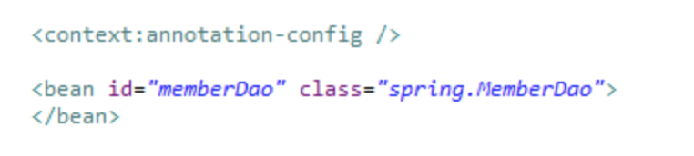

# Annotation
  
1. Annotation 이란?
   -  @를 이용한 주석, 자바코드에 주석을 달아 특별한 의미를 부여한 것
      (참고로 클래스, 메소드, 변수 등 모든 요소에 선언이 가능)
   - 메타데이터(실제데이터가 아닌 Data를 위한 데이터) 라고도 불리고 JDK5부터 등장
   - 컴파일러가 특정 오류를 억제하도록 지시하는 것과 같이 프로그램 코드의 일부가 아닌 
     프로그램에 관한 데이터를 제공, 코드에 정보를 추가하는 정형화된 방법.
   (프로그램에게 추가적인 정보를 제공해주는 메타데이터이다.)  
ex) @Repository, @Service, @Controller, @Autowired, @Resource

2. Annotation이 나온 이유
    IT가 발전하면서 프로그램의 규모가 방대해지면서 XML이 가지는 설정정보의 양이 많아진다
--> Annotation은 직관적인 메타데이터 설정이 가능. 왜냐하면 소스코드와 같이 쓰기 때문에 
      (소스코드와 메타데이터가 결합되는 형태)
--> 시스템 전반에 영향을 주는 메타데이터는 XML로 설정하여 코드로부터 독립적으로 분리되는 것이 바람직하다. 
그래서 변경사항이 있을 때 유지보수성이 높아진다. 
설계시 확정되는 부분은 Annotation 기반 설정으로 개발의 생산성을 향상 시키는 것이 바람직함

(+추가)
기본 웹어플리케이션들의 문제점
거존의 자바 웹어플리케이션들은 선언적인 프로그래밍 방식을 사용한다. 선언적이란 프로그램의 전체 및 각 레이어별 구성과 설정값들을 외부의 xml 설정파일에 명시하는 방식을 말한다. 변경이 될 수 있는 데이터들을 최대한 코드가 아닌 외부설정파일에 분리하기 때문에 변경 요구사항이 들어왔을 때, 재컴파일 없이도 쉽게 변경사항을 적용할 수 가 있다. 유연성이란 장점을 얻었지만, 단점 또한 존재한다. 프로그램 작성을 위해 매번 많은 설정파일을 작성해야 한다는 것이다. 그 규모가 커질수록 설정의 양도 많아지게 되며 이를 잘 구조화 할 수 있는 방법도 필요하게 된다. 또 하나의 단점은 이것보다 좀 더 크다. 도메인 데이터 처리정보가 model 클래스, 서비스 클래스, xml 설정파일에 분산되어 있어서, 이를 확인 하기위해서는 model, service 클래스와 xml 설정파일을 모두 뒤져야 한다는 것이다.

3. Annotation을 사용할때 장점은?

어노테이션을 사용하면 위와 같은 문제를 해결 할 수 있다. 데이터에 대한 유효성 검사조건을 어노테이션을 사용하여 model 클래스에 직접 명시함으로써 해당 데이터들에 대한 유효조건을 쉽게 파악할 수 있게되며, 코드의 양도 줄어든다.
(엄밀히 말하면, 코드의 양은 줄어들지 않는다. 하지만 코드가 깔끔해지고, 어노테이션의 재사용도 가능해진다.)

4. 그렇다면 xml 설정은 사용하지 않아야 하는가?

앞서 말했다시피, xml은 유연성을 확보해준다. 어노테이션을 사용하여 한번 빌드된 코드는 수정을 위해서는 재컴파일 해야하는 단점이 있다. 어플리케이션 전체적인 설정이나 디플로이 환경에 따라 변경되는 사항들은 xml 설정을 사용하자. 각각의 장단점을 파악하고, 언제 무엇을 사용해야할지 아는 것이 중요하다.

5. 일반적인 Annotation을 용도

어노테이션은 크게 문서화,컴파일러체크,코드 분석을 위한 용도로 사용된다. 문법적으로는 @ 기호가 붙은 심볼을 사용하며 패키지, 클래스, 메소드, 프로퍼티, 변수에 명시할 수 있다. 이 어노테이션이 붙은 소스를 컴파일 시에 수집하여 API 문서화 할 수도 있지만 기존에 javaDoc이라는 좋은 문서화 도구가 있기 떄문에 "문서화"는 가장 비중이 낮은 어노테이션의 사용법이다.
또한 컴파일 타임에 에러를 발생시켜 주어 개발자에서 위험요소를 경고해주거나 확인하는 목적으로도 사용된다.
가장 큰 비중을 갖는 것은 코드 분석 또는 Meta데이터로서 용도이다. 메타데이터란 데이터를 위한 데이터, 즉 데이터에 대해 설명하는 데이터를 의미한다. 메타데이터로서 어노테이션의 효용을 가장 잘 느낄 수 있는 부분이 JEE 설정과 유효성 검사 부분이다.
 1) 파일러에게 코드 작성 문법에러를 체크하도록 정보를 제공(@ovrride)
     - 메소드가 재정의 되었는지 확인할 수 있다.
 2) 소프트웨어 개발 툴이나 빌드나 배치시 코드를 자동으로 생성할 수 있도록 정보를 제공
     - xml 설정 파일을 자동 생성하거나 배포를 위한 jar압축 파일을 자동 생성할 수 있다.
 3) 실행시(런타임시)특정 기능을 실행하도록 정보를 제공
     - 객체가 어플리케이션 내부에서 해야할 역할을 정의할 수 있다.(서블릿,컨트롤러,...)

<!-- -->

   
6. Annotation 종류
 1) @Component -> @Controller, @Service , @Repository를 다 포함하고 있다.
 2) @Requestmapping -> 요청 URL을 어떤 메서드가 처리할지 mapping해주는 애노테이션이다.
 3) @requestparam -> @PathVariable과 비슷하다. request의 parameter에서 가져오는 것이다. 메소드의 파라미터에 사용됨
 4) @PathVariable -> 메서드 파라미터 앞에 사용하면서 해당 URL에서 {특정값}을 변수로 받아 올 수 있다.
 5) @RequestBody -> 요청이 온 데이터(JSON이나 XML형식)를 바로 클래스나 model로 매핑하기 위한 애노테이션
 6) @ResponseBody -> view가 아닌 JSON 형식의 값을 응답할 때 사용하는 애노테이션으로 문자열을 리턴하면 그 값을 http response header가 아닌 response body에 들어간다.
만약 객체를 return하는 경우 JACKSON 라이브러리에 의해 문자열로 변환되어 전송된다.
context에 설정된 resolver를 무시한다고 보면된다. (viewResolver)
 
 등등 많다.

7. autowired
의존관계를 자동으로 설정할때 사용한다.
생성자,필드,메소드 3곳에 적용가능하다.
Spring Framework 에서 지원하는 Dependency 정의 용도의 어노테이션 자동주입이며 종속적이다
스프링프레임워크 종속적이다

위의 xml파일에 bean을 등록한것처럼 빈등록만 한다면 <property>태그나 <constructor-arg>태그를 사용하지 않아도 된다. 빈으로 등록한 memberDao를 이용하여 다른클래스에선 똑같이 그냥 빈만 등록하고 그 클래스에서 의존을 주입하고싶은 빈 대상이 있을경우 @Autowired로 자동 의존 주입하면 된다. 

- 출처 : https://palyoung.tistory.com/72
- 출처(autowired에 관하여) : https://articles09.tistory.com/28 
 
 

<질문>
1.디플로이가 뭘까요?
2.javaDoc는 무엇일까요?
3.JEE 설정
4.메타데이터란? (데이터를 위한 데이터 뭔 개소리야~ -> 데이터를 빨리 찾기 위한 것으로, 컴퓨터에서 정보의 인덱스 구실을 한다. 우리가 많이 사용하는 데이터베이스도 이러한 메타데이터가 잘 구성되어 있기 때문에 데이터를 빨리 찾을 수 있다. 메타데이터의 가장 좋은 예가 HTML 태그이다. 데이터에 관한 구조화라는 것은 HTML 태그 안에 head나 body가 있으며, body안에는 table이 올 수 있고 , table안에는 tr이 tr 안에는 td가 올 수 있는 것처럼 데이터가 상위에서 하위로 나무 형태의 구조를 이루고 있다는 의미이다.)
