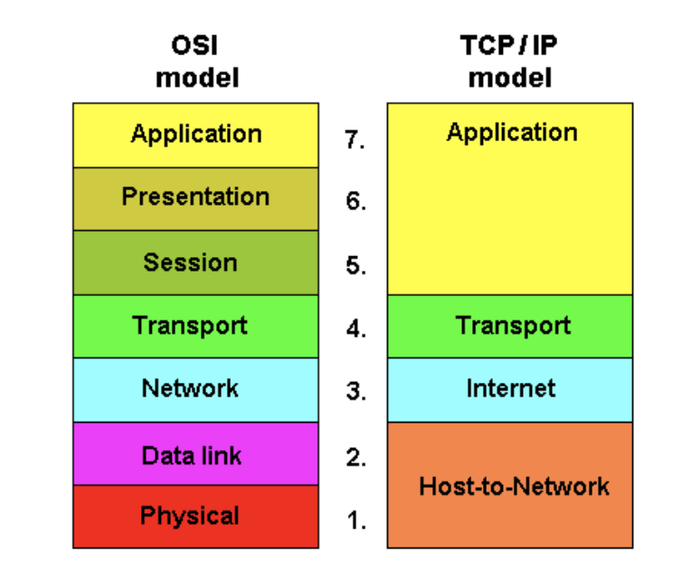
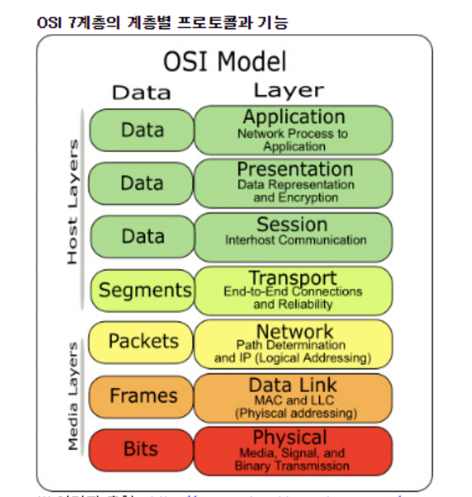
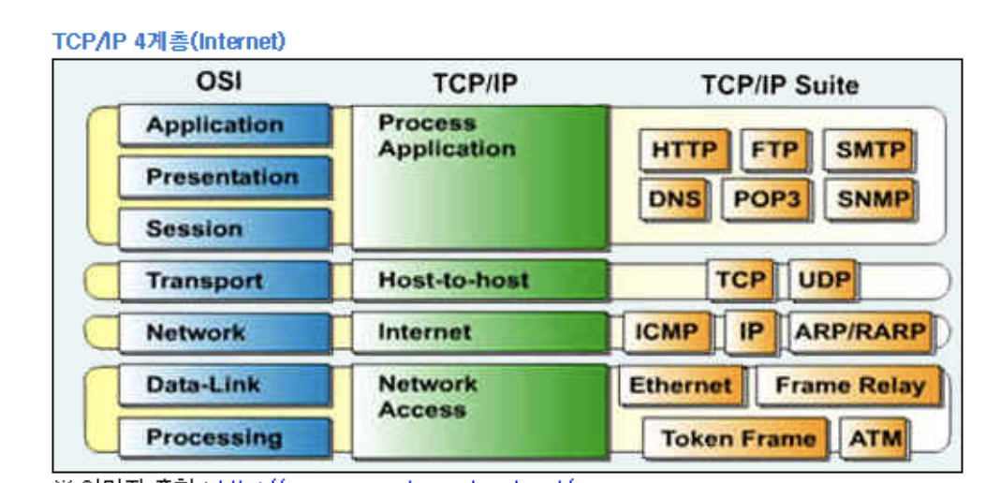

# [OSI 7계층, TCP/IP 4계층] 네트워크의 기본 계층 구조

# 1. OSI 7계층

 이 모형을 이용하면 특정 네트워킹 시스템에서 일어나는 일을 계층을 활용해 시각적으로 쉽게 설명할 수 있다. 덕분에 네트워크 관리자는 어떤 문제의 원인이 어디에 있는지 범위를 좁힐 수 있다. 예를 들어 물리적인 문제인지 아니면 응용프로그램과 관련이 있는지 쉽게 파악할 수 있다. 이는 컴퓨터 프로그래머에게도 도움이 된다. 응용프로그램 개발 시 다른 어떤 계층에 작업이 필요한지 쉽게 파악할 수 있기 때문이다.

IT 기업은 고객에게 신제품을 설명할 때 OSI 모형을 많이 활용한다. 해당 제품이 어떤 계층에서 작동하는지 아니면 “스택 전체에 걸쳐” 작동하는지 설명한다.

OSI 모델은 1970년대에 등장한 2가지 별도 모형을 1983년에 합쳐 1984년에 처음 공개됐다. OSI 모형을 설명할 때 대부분 맨 위 7계층부터 시작해 맨 아래 1계층까지 내려온다. 각 계층과 이들의 의미하는 바는 다음과 같다.

- 사용자와 가장 밀접한 계층, 인터페이스(Interface) 역할

- 응용 프로세스 간의 정보 교환 담당 / 전송 단위 : Message

- EX : 전자 메일, 인터넷, 동영상 플레이어 등의 Applicasation

## : User Interface 를 제공하는 계층

6계층 – 표현 계층(Presentation): 표현 계층은 응용 계층의 데이터 표현에서 독립적인 부분을 나타낸다. 일반적으로 응용프로그램 형식을 준비 또는 네트워크 형식으로 변환하거나 네트워크 형식을 응용프로그램 형식으로 변환하는 것을 나타낸다. 다시 말해 이 계층은 응용프로그램이나 네트워크를 위해 데이터를 “표현”하는 것이다. 대표적인 예로는 데이터를 안전하게 전송하기 위해 암호화, 복호화하는 것인데, 이 작업이 바로 6계층에서 처리된다.

- 데이터 표현에 차이가 있는 응용처리에서의 제어구조를 제공 ※ 데이터 표현에 차이 : ASCII, JPEG, MPEG 등의 번역

- 전송하는 데이터의 인코딩, 디코딩, 암호화, 코드 변환 등을 수행 / 전송 단위 : Message

## : 데이터의 변환 작업을 하는 계층

5계층 – 세션 계층(Session): 2대의 기기, 컴퓨터 또는 서버 간에 “대화”가 필요하면 세션(session)을 만들어야 하는데 이 작업이 여기서 처리된다. 이 계층에는 설정, 조율(예: 시스템의 응답 대기 기간), 세션 마지막에 응용프로그램 간의 종료 등의 기능이 필요하다.

- 통신장치 간 상호작용 및 동기화를 제공

- 연결 세션에서 데이터 교환,  에러 발생 시 복구 관리 => 논리적 연결 담당 / 전송 단위 : Message

- 4계층 장비 : NetBIOS (세션 내 연결관리 및 에러감지, 복구 수행), SSH, Appletalk  (Port는 4~5계층 경계 모호)
- 
## : 응용 프로그램 간의 연결을 지원해주는 계층

4계층 – 전송 계층(Transport): 전송 계층은 최종 시스템 및 호스트 간의 데이터 전송 조율을 담당한다. 보낼 데이터의 용량과 속도, 목적지 등을 처리한다. 전송 계층의 예 중에서 가장 잘 알려진 것이 전송 제어 프로토콜(TCP)이다. TCP는 인터넷 프로토콜(IP) 위에 구축되는데 흔히 TCP/IP로 알려져 있다. 기기의 IP 주소가 여기서 작동한다.

- 종단 간(End-to-End)에 신뢰성 있고 정확한 데이터 전송을 담당 / 전송 단위 : Segment

- 4계층에서 전송 되는 단위 => 세그먼트(Segment), 종단 간의 에러 복구와 흐름 제어 담당  ex) TCP/UDP

- 4계층 장비 : L4 스위치 (3계층 트래픽 분석, 서비스 종류 구분)
- 
## : 서비스를 구분하고 데이터의 전송 방식을 담당하는 계층 (TCP/UDP)

3계층 – 네트워크 계층(Network): 네트워킹 전문가 대부분이 관심을 두고 좋아하는 라우터 기능 대부분이 여기 네트워크 계층에 자리잡는다. 가장 기본적으로 볼 때 이 계층은 다른 여러 라우터를 통한 라우팅을 비롯한 패킷 전달을 담당한다. 보스턴에 있는 컴퓨터가 캘리포니아에 있는 서버에 연결하려고 할 때 그 경로는 수백 만 가지다. 이 계층의 라우터가 이 작업을 효율적으로 처리한다.

- 중계 노드를 통하여 전송하는 경우, 어떻게 중계할 것인가를 규정  / 전송 단위 : Packet

- 데이터를 목적지까지 가장 안전하고 빠르게 전달 => 라우팅

- 3계층 장비 : 라우터, L3 스위치

## : 네트워크를 논리적으로 구분하고 연결하는 계층 - 논리적 주소 사용

2계층 – 데이터 링크 계층(Data Link): 데이터 링크 계층은 (두 개의 직접 연결된 노드 사이의) 노드 간 데이터 전송을 제공하며 물리 계층의 오류 수정도 처리한다. 여기에는 2개의 부계층도 존재한다. 하나는 매체 접근 제어(MAC) 계층이고 다른 하나는 논리적 연결 제어(LLC) 계층이다. 네트워킹 세계에서 대부분 스위치는 2계층에서 작동한다.

- 물리적인 연결을 통하여 인접한 두 장치간의 신뢰성 있는 정보 전송을 담당   / 전송 단위 : Frame

- 정보의 오류와 흐름을 관리. 안정된 정보 전달 　　 　　 　　

- 2계층 장비 : 브리지, 스위치

## : 물리적 매체에 패킷 데이터를 실어 보내는 계층 - 환경에 맞는 다양한 통신 프로토콜 지원

1계층 – 물리 계층(Physical): OSI 디핑 소스의 밑바닥에는 물리 계층이 있다. 시스템의 전기적, 물리적 표현을 나타낸다. 케이블 종류, (802.11 무선 시스템에서와 같은) 무선 주파수 링크는 물론 핀 배치, 전압, 물리 요건 등이 포함된다. 네트워킹 문제가 발생하면 많은 네트워크 전문가가 물리 계층으로 바로 가서 모든 케이블이 제대로 연결돼 있는지, 라우터나 스위치 또는 컴퓨터에서 전원 플러그가 빠지지 않았는지 확인한다. 

- 전기적, 기계적 특성을 이용하여, 통신 케이블로 전기적 신호(에너지)를 전송   / 전송 단위 : bit

- 단지 데이터 전달 역할만을 하고, 알고리즘, 오류 제어 기능 존재 X  　　 

- 1계층 장비 : 리피터, 허브, 케이블

## : 신호로 변환하여 전송하는 계층

## OSI 7계층에 대해 알아야할 것
 
네트워크 관련 자격증을 따려면 여러 가지 계층에 대해 알아야 할 것이다. 공무원 지망생이 미국 정부의 3대 기관을 알아야 하는 것과 마찬가지다. 그 후에 OSI 모형에 대해 듣게 되는 것은 업체가 자신의 제품이 어떤 계층(들)에서 작동하는지 설명할 때다. OSI 모형의 목적에 대해서 묻는 쿼라(Quora) 게시물에서 비크람 쿠는 “OSI 참조 모델의 목적은 업체 및 개발자가 만드는 디지털 통신 제품과 소프트웨어 프로그램이 상호 연동될 수 있도록 안내하고 통신 도구 간의 명확한 비교를 쉽게 하는 것이다”라고 답했다.

어떤 사람들은 OSI 모형이 한물간 모형이라고 주장한다(이론적인 속성 때문이며 TCP/IP 모형의 4계층보다 중요성이 떨어진다). 쿠마는 “그러나 오늘날 네트워킹 기술에 관한 기사 등에서 OSI 모형과 그 계층이 언급되지 않는 경우는 드물다. 왜냐하면 모형의 구조가 프로토콜 논의의 틀을 세우고 다양한 기술을 대비시키는 데 도움이 되기 때문이다”라고 말했다. 실제로 OSI 모형과 그 계층을 이해하면 신기술을 봤을 때 어떤 프로토콜과 기기가 서로 연동되는지도 이해할 수 있다.

# TCP/IP Protocol (4계층)

 TCP/IP는 현재의 인터넷에서 컴퓨터들이 서로 정보를 주고받는데 쓰이는 통신규약 (프로토콜)의 모음이다. 1960년대 말 미국방성의 연구에서 시작되어 1980년대 초 프로토콜 모델이 공개 되었으며,  하드웨어, 운영체제, 접속매체에 관계없이 동작할 수 있는 개방성을 가진다.

 

## 4계층 - Application Layer

(1) OSI 7 Layer에서 세션계층 , 프레젠테이션계층, 애플리케이션 계층에 해당한다. (5, 6, 7계층)
(2) 응용프로그램들이 네트워크서비스, 메일서비스, 웹서비스 등을 할 수 있도록 표준적인 인터페이스를 제공한다.
- TCP/IP 기반의 응용 프로그램을 구분할 때 사용한다.
- 프로토콜 : HTTP, FTP, Telnet, DNS, SMTP

## 3계층 - Transport Layer

(1) OSI 7 Layer에서 전송계층에 해당한다.
(2) 네트워크 양단의 송수신 호스트 사이에서 신뢰성 있는 전송기능을 제공한다.
(3) 시스템의 논리주소와 포트를 가지고 있어서 각 상위 계층의 프로세스를 연결해서 통신한다.
(4) 정확한 패킷의 전송을 보장하는 TCP와 정확한 전송을 보장하지 않는 UDP 프로토 콜을 이용한다.
(5) 데이터의 정확한 전송보다 빠른 속도의 전송이 필요한 멀티미디어 통신에서 UDP 를 사용하면 TCP보다 유용하다.

- 통신 노드 간의 연결을 제어하고, 자료의 송수신을 담당
- 프로토콜 : TCP, UDP

## 2계층 - Internet Layer

(1) OSI 7 Layer의 네트워크 계층에 해당한다.
(2) 인터넷 계층의 주요 기능은 상위 트랜스포트 계층으로부터 받은 데이터에 IP패킷 헤더를 붙여 IP패킷을 만들고 이를 전송하는 것이다.

- 통신 노드 간의 IP 패킷을 전송하는 기능 및 라우팅 기능을 담당
- 프로토콜 : IP, ARP, RARP, ICMP, OSPF

## 1계층 - Network Access Layer

(1) OSI 7 Layer에서 물리계층과 데이터링크 계층에 해당한다.
(2) OS의 네트워크 카드와 디바이스 드라이버 등과 같이 하드웨어적인 요소와 관련되 는 모든 것을 지원하는 계층
(3) 송신측 컴퓨터의 경우 상위 계층으로부터 전달받은 패킷에 물리적인 주소은 MAC 주소 정보를 가지고 있는 헤더를 추가하여 프레임을 만들고, 프레임을 하위계층인 물 리 계층으로 전달한다.
(4) 수신측 컴퓨터의 경우 데이터 링크 계층에서 추가된 헤더를 제거하여 상위 계층인 네트워크 계층으로 전달한다.

- CSMA/CD, MAC, LAN, X25, 패킷망, 위성 통신, 다이얼 모뎀 등 전송에 사용
- 프로토콜 : Ehternet(이더넷), Token Ring, PPP

##  * OSI 모델과 TCP/IP 모델 비교

- TCP/IP 프로토콜은 OSI 모델보다 먼저 개발되었다. 그러므로 TCP/IP 프로토콜의 계층은 OSI 모델의 계층과 정확하게 일치하지 않는다.
- 두 계층을 비교할 때 , 세션(Session)과 표현(presentation) 2개의 계층이 TCP/IP프로토콜 그룹에 없다는 것을 알 수 있다.
- 두 모델 모두 계층형 이라는 공통점을 가지고 있으며 TCP/IP는 인터넷 개발 이후 계속 표준화되어 신뢰성이 우수인 반면, OSI 7 Layer는 표준이 되기는 하지만 실제적으로 구현되는 예가 거의 없어 신뢰성이 저하되어있다.
- OSI 7 Layer는 장비 개발과 통신 자체를 어떻게 표준으로 잡을지 사용되는 반면에 실 질적인 통신 자체는 TCP/IP 프로토콜을 사용한다.

- 출처: https://ryusae.tistory.com/4 [초보자 전용 마을]

