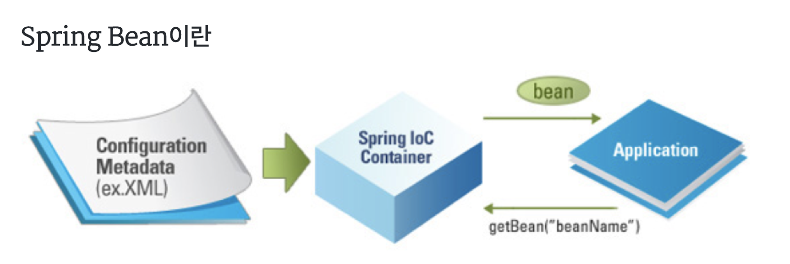
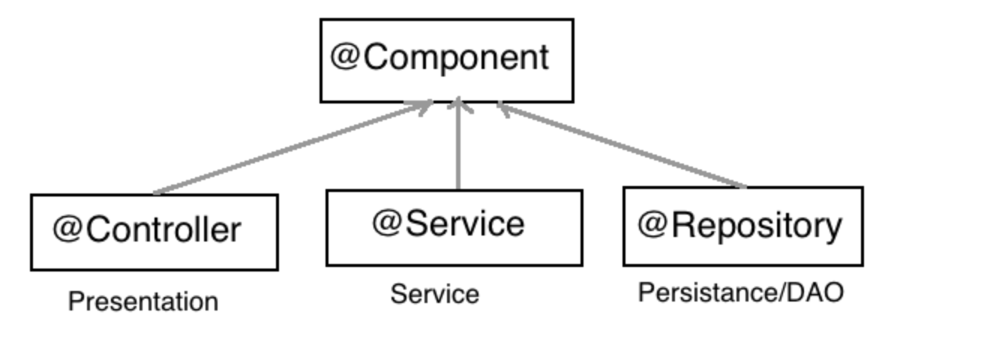

# Bean
  

 1.Bean 이란?

 Spring에서 POJO(plain, old java object)를 ‘Beans’라고 부른다.
Beans는 애플리케이션의 핵심을 이루는 객체이며, Spring IoC(Inversion of Control) 컨테이너에 의해 인스턴스화, 관리, 생성된다.
Beans는 우리가 컨테이너에 공급하는 설정 메타 데이터(XML 파일)에 의해 생성된다.
컨테이너는 이 메타 데이터를 통해 Bean의 생성, Bean Life Cycle, Bean Dependency(종속성) 등을 알 수 있다.
애플리케이션의 객체가 지정되면, 해당 객체는 getBean() 메서드를 통해 가져올 수 있다.
 
 Spring Bean이란
자주 사용하는 객체를 singleton으로 만들어 놓고 어디서든 불러쓸 수 있도록 한 것.
Java에서도 bean은 재사용이 가능하게 만들어진 component이다.
(component는 독립적인 모듈이라고 보면 된다.)

우선 스프링은 경량 컨테이너로서 객체 생성, 소멸과 같은 Life Cycle을 관리하며 스프링 컨테이너로부터 필요한 객체를 얻을 수 있다. 
스프링 컨테이너에 의해서 자바 객체가 만들어지게 되면 이 객체를 스프링은 스프링 빈(Bean)이라고 부른다.
스프링 빈과 자바 일반 객체와의 차이점은 없고 스프링 컨테이너에 의해 만들어진 객체를 스프링 빈이라고 부를 뿐이다.

 <엄청 쉽게 설명한 예>
 과학자가 로봇트를 만들어요. 
철수는 팔을 만들고 
영희는 다리를 만들고
토마스는 몸통을 만들어요. 
근데 이게 1대만 만드느냐? 아니거든요 100대 만들어야되요..
그럼 철수는 팔만 죽어라 100개 만들어요 
영희는 다리만 죽어라 100개 만들어요. 
그리고 글쓴이가 철수한테는 팔, 영희한테는 다리를 받아서 조립해요 
글쓴이는 조립만 죽어라 하는거죠... 
이때 팔, 다리, 몸통 이게 빈이에요

<조금 전문적으로 설명한 예>
간단히 회원 가입하고 회원 목록을 출력하는 사이트가 있다면
그런 일들을 해주는 Controller가 있을 텐데
예를 들면, LoginController, MemberAddConroller, MemberDeleteController 등등
이런 아이들을 초반에 미리 생성해 놓는 것이 Bean 인거 같습니다.
그리고 필요할 때( 예를 들면, 사용자가 login.do를 요청하거나, add.do를 요청하거나 등등)
가져다 쓸수 있는 그런 인스턴스들을 말하는 거 같구요
그럼 가져다 쓸 수 있다는 데 언제 어떻게 만들어 놓느냐? - 제가 공부한 책으로 설명드리면
리스너(어플리케이션을 처음 시작할 때 실행되는 기능을 갖춘 클래스)에서 만들어 둡니다.
(물론, 리스너 안에서도 ApplicationContext라는 클래스를 만들어서 합니다.)
저도 '빈'에 대해서 검색하고 설명 읽다가 포기하고 책보며 사이트를 직접 만들어 보다가
예시소스에 getBean이라는 메서드를 사용한 부분을 추적하며 getBean이라는 이름을 저자가
그냥 짓지는 않았을 텐데 Bean을 얻어 온다는 뜻으로 지은 것일텐데 하며...그 얻어오는 부분을 추적하고
추적한 끝에 대충 감을 잡을수 있었습니다.

스프링 빈의 어노테이션 종류
스프링부트의 경우 @Component, @Service, @Controller, @Repository, @Bean, @Configuration 등으로 필요한 빈들을 등록하고 필요한 곳에서 @Autowired를 통해 주입받아 사용하는 것이 일반적이다.

다음 그림과 같이 @Service, @Controller, @Repository는 모두 @Component를 상속받고 있으며 해당 어노테이션으로 등록된 클래스들은 스프링 컨테이너에 의해 자동으로 생성되어 스프링 빈으로 등록된다.

[ @Component & @Autowired ]

스프링부트에서 사용자 클래스를 스프링 빈으로 등록하는 가장 쉬운 방법은 클래스 선언부 위에 Component Annotation을 사용하는 것이다.  @Component가 붙은 클래스는 스프링 빈 객체로 등록이 되어 객체 생성/삭제를 스프링에서 관리할 수 있다.

- 출처 : https://cbw1030.tistory.com/54

<질문>
1.디플로이가 뭘까요?
2.javaDoc는 무엇일까요?
3.JEE 설정
4.메타데이터란? (데이터를 위한 데이터 뭔 개소리야~ -> 데이터를 빨리 찾기 위한 것으로, 컴퓨터에서 정보의 인덱스 구실을 한다. 우리가 많이 사용하는 데이터베이스도 이러한 메타데이터가 잘 구성되어 있기 때문에 데이터를 빨리 찾을 수 있다. 메타데이터의 가장 좋은 예가 HTML 태그이다. 데이터에 관한 구조화라는 것은 HTML 태그 안에 head나 body가 있으며, body안에는 table이 올 수 있고 , table안에는 tr이 tr 안에는 td가 올 수 있는 것처럼 데이터가 상위에서 하위로 나무 형태의 구조를 이루고 있다는 의미이다.)

<!-- -->