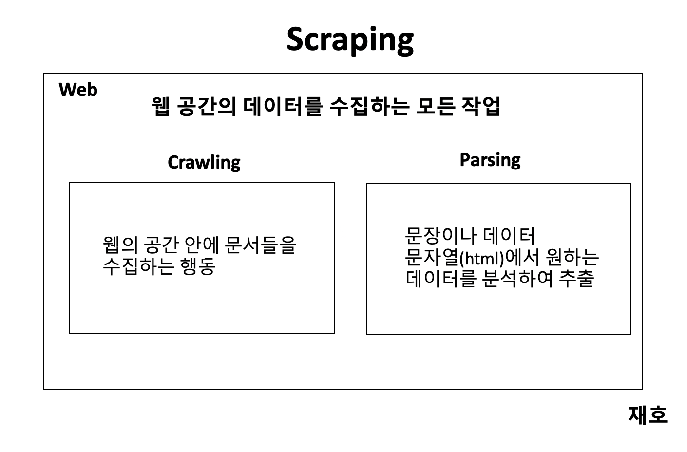

# crawling, parsing, scraping
   - 들어가기 전에 알아야 할 점

크롤링(crawling)과 파싱(parsing)은 포괄적인 의미로 스크래핑(Scraping)의 범주에 포함이 된다고 할수 있다.
스크래핑(Scraping)이란 웹이라는 공간에 있는 내용을 가져와 원하는 형태로 가공하는 것으로, 웹공간의 데이터를 수집하는 모든 작업을 의미한다라고 볼수 있다.
크롤링(crawling)과 파싱(parsing)은 스크래핑(Scraping)의 범주내에 포함이 된다고 볼수 있으며 데이터의 수집에 있어 스크래핑(Scraping)을 이용한 크롤링과 파싱(parsing)으로 데이터를 탐색할 수 있다.

## 크롤링(crawling)

   - 웹의 공간안에 문서들을 수집하는 행동을 의미 

여기서 말하는 크롤링(crawling)의 행동이란 자동화된 방법으로 조직적으로 탐색을 한다.
우리 눈에 볼수 없지만 무수히 많은 자동화된 로봇들이 웹사이트에 방문하여 페이지의 문서나 이미지, 영상을 읽어가서 저장하여 분류한다.  
이러한 크롤링(행동)들은 수 많은 정보들을 보다 쉽게 찾기 위한 목적이라 볼 수 있다.
대표적인 예로 검색엔진인 구글, 포털인 네이버/다음에서 조직적이며 자동화된 로봇들을 운영한다.
이런 로봇(봇)들이 쉬지않고 무수히 많은 웹사이트의 페이지를 크롤링하여 저장, 인덱싱을 하고 있다.
이러한 검색분류를 우리같은 사용자가 해당 검색엔진이나 포털에서 원하는 정보를 검색해서 정보를 얻어 가고 있다.
온라인상에는 수없이 많은 정보들이 존재하다보니 경쟁이 되어 검색에서 우선순위로 올라 가기 위해 많은 노력들을 하고 있다.
  
크롤링(crawling)는 무수히 많은 정보화 시대에서 점점 발전 및 개발이 되고 있다.
수만가지의 각기 다른 환경, 각기 다른 사용목적에 따라 크롤링(crawling) 기술은 매우 광범위하게 변화하고 있다.
검색엔진이나 포털에서만 사용하는것만 국한하지 않고 기업의 업무용, 연구를 위한 데이터 수집 등등 각기 다른 목적에 따라 많은 방식과 환경으로 변화하고 있다.
  

  - 정리  
이런 광범위한 크롤링(crawling)에 대한 기술을 나의 소견으로 모두 정의 할 수는 없지만
쉽게 설명을 하면, 수많은 웹의 공간에 있는 정보들을 조직적 자동화된 로봇들이
데이터를 수집, 저장, 분류, 가공하여 인덱싱하는 행동이라고 볼 수 있다.

## 파싱(parsing)

   - 파싱(parsing)은 쉽게말해 문장이나 데이터문자열(html, json 등)에서 원하는 데이터를 분석하여 추출하는 기술

특정한 패턴과 규칙, 순서를 이용하여 자신이 필요로 하는 데이터를 추출해내는 작업이다. 
**엄격히 말해서 크롤링은 웹데이터를 가져오는 행위 자체를 의미하며 파싱은 크롤링으로 가져온 데이터에서 필요한 정보를 추출하는 것을 말한다.**  
국내에서는 크롤링과 파싱을 구분하지 않고 일반적으로 파싱이라 칭하는 경우가 많다.

예)
기상청의 날씨 정보를 가져와 저장하여 자신에게 맞는 형태로 자동으로 가공 저장한다.
지도정보 및 데이터를 수집에 자신에게 맞는 형태로 자동으로 가공 저장한다.
이러한 형태는 자신이 필요한 정보가 있는 웹사이트에 자신이 필요한 정보 및 데이터를 수집하여
저장하고 가공하여 다시 활용할 수 있다.
파싱(parsing)의 형태는 사용하는 언어에 따라 다양하게 개발이 되고 있고 사이트의 환경에 따라 데이터를 수집하는 기술이 다양하게 바뀌고 있다.
아주 많은 각기 다른 환경의 웹사이트에서 자신에게 필요한 데이터를 수집하기 위해서 파싱의 기술도 다양하고 폭넓게 개발이 되고 있다.

## 스크래핑(scraping)

스크래핑이란 HTTP를 통해 웹 사이트의 내용을 긁어다 원하는 형태로 가공하는 것이다.
쉽게 말해 웹 사이트의 데이터를 수집하는 모든 작업을 뜻한다. 다시 말해 웹이라는 공간에 있는 내용을 가져와 원하는 형태로 가공하는 것으로, 웹공간의 데이터를 수집하는 모든 작업을 의미한다라고 볼수 있다.
크롤링도 일종의 스크래핑 기술이라고 할 수 있다.
  
   

  
