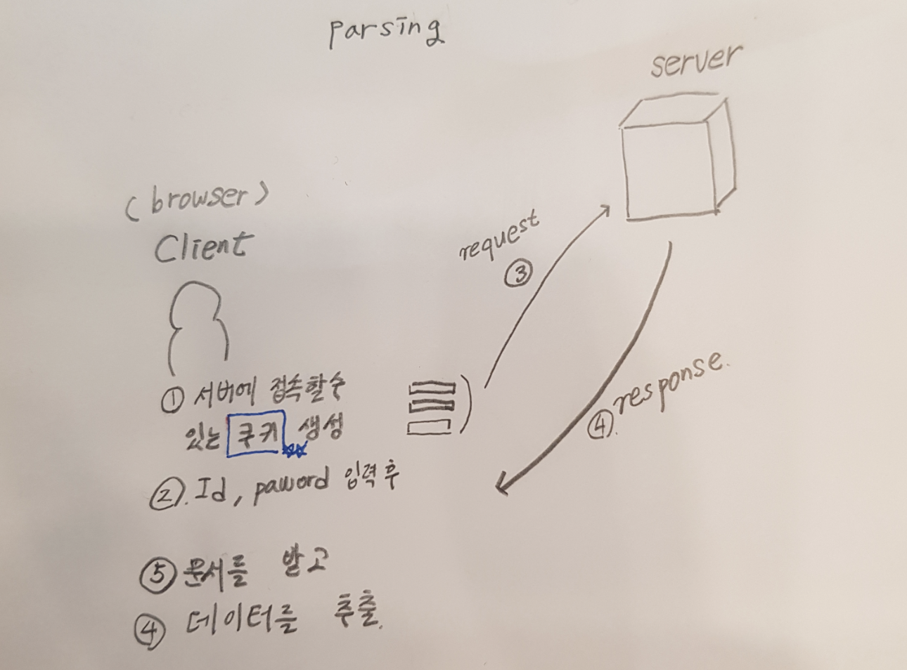

# Session and Cookie
  
   - 들어가기 전에
      


파싱을 구현할때 로그인 화면에서 주는 쿠키를 같이 넘겨주지 않는다면 파싱이 되지 않는 점을 새롭게 알게 되었다.<br>
그러면 내가 알고 있는 쿠키에 대한 용도를 적어보자
   - 웹페이지의 로딩을 느리게 만드는 요인을 해결해주는 역할
   - 로그인 상태를 유지

굉장히 내가 보고싶은 부분만 공부했던 것 같다. 그래서 다시 한번 공부해보았다.


## Cookie
cookie의 목적(3가지)

1. 세션 관리(Session Management) <br>
로그인, 사용자 닉네임, 접속 시간, 장바구니 등의 서버가 알아야할 정보들을 저장합니다.

2. 개인화(Personalization) <br>
사용자마다 다르게 그 사람에 적절한 페이지를 보여줄 수 있습니다.
3. 트래킹(Tracking) <br>
사용자의 행동과 패턴을 분석하고 기록합니다.
세션은 쿠키를 이용합니다. 어떤 웹 브라우저가 서버에 요청을 하면 서버는 세션 아이디를 할당해서 응답할 때 함께 전달합니다. 웹 브라우저는 이 세션 아이디를 쿠키에 저장해두고 매 요청마다 세션 아이디를 함께 전달합니다. 서버는 세션 아이디를 바탕으로 사용자를 식별하고 사용자의 데이터를 서버에 저장하여 관리합니다.


  

  
### Set-Cookie, Cookie Header

쿠키는 서버가 사용자의 웹 브라우저에 저장하는 데이터라고 했습니다. 쿠키의 데이터 형태는 Key 와 Value로 구성되고 String으로만 이루어져 있습니다. 4KB 이상 저장할 수는 없습니다.

브라우저마다 저장되는 쿠키는 다릅니다. (크롬으로 남긴 쿠키는 인터넷 익스플로어에서 사용할 수 없습니다.) 서버에서는 브라우저가 다르면 다른 사용자로 인식합니다.

~~~
Set-Cookie: <cookie-name>=<cookie-value>
~~~

클라이언트는 서버로 전송하는 모든 요청에 현재 브라우저에 저장된 모든 쿠키를 Header의 Cookie로 전달합니다.
~~~
Cookie: <cookie-name>=<cookie-value>
~~~

서버가 쿠키와 함께 아래와 같은 응답을 클라이언트에게 전달했다고 하면,
~~~
HTTP/1.0 200 OK
Content-type: text/html
Set-Cookie: yummy_cookie=choco
Set-Cookie: tasty_cookie=strawberry

[page content]
~~~
이후로는 해당 클라이언트는 매번 저장된 쿠키를 헤더에 포함해서 요청을 보내게 됩니다.
~~~
GET /sample_page.html HTTP/1.1
Host: www.example.org
Cookie: yummy_cookie=choco; tasty_cookie=strawberry
~~~
웹 브라우저의 검사(Inspection) 기능을 이용하면 Application 탭에서 저장된 Cookies를 확인할 수 있습니다. 임의로 추가, 변경, 제거도 가능합니다.

### Session 쿠키 & Permanent 쿠키
위에서 살펴본 쿠키는 Session 쿠키입니다. Session 쿠키란 웹 브라우저가 종료될 때 제거되는 쿠키를 말합니다. 브라우저가 종료되더라도 쿠키를 유지하고 싶으면 Permanent를 이용하면 됩니다. 쿠키를 생성할 때 ```Expires``` 혹은 ```Max-Age``` 옵션을 추가하면됩니다.

   - Expires: 쿠키가 만료될 날짜를 지정합니다.
   - Max-Age: 현재 시간을 기준으로 얼마 동안 유지시킬 것인가를 지정합니다.
  

  ~~~
  Set-Cookie: yummy_cokie=choco; Expires=Wed, 21 Oct 2015 07:28:00 GMT;
  ~~~

<br>

 ### Secure & HttpOnly & Path & Domain 옵션

   - Secure: HTTPS 프로토콜 상에서 암호화된 요청일 경우에만 전송됩니다.
   - HttpOnly: Cross-site 스크립팅 공격을 방지합니다. JavaScript의 document.cookie API에 접근할 수 없습니다.
   - Domain, Path: 쿠키의 스코프를 정의합니다.

~~~
Set-Cookie: yummy_cokie=choco; secure; httpOnly;
~~~

쿠키의 용도
쿠키가 있기 때문에 여러 페이지를 이동할 때마다 로그인을 하지 않고 사용자 정보를 유지할 수 있는 것입니다. (쿠키가 없다면 다음 페이지로 정보를 파라미터로 넘겨줘야 합니다.)

   - ID 저장, 로그인 상태 유지 (여기서 말하는 ID는 무엇으로 지정하냐에 따라서 다르다.)
   - 7일간 다시 보지 않기. (쿠키에 체크한 날짜를 기록하여 다시 방문 했을 때의 시간과 시차를 이용하여 계산)
   - 최근 검색한 상품들을 광고에서 추천
   - 쇼핑몰 장바구니 기능


## 세션(Session)
페이지를 이동해도 사용자의 로그인 상태를 유지하는 기능을 생각해 봅시다. 앞서 살펴본 쿠키를 이용해서 사용자의 아이디와 비밀번호를 쿠키에 저장한다고 가정해 봅시다. 페이지를 이동하여도 쿠키를 통해 아이디와 비밀번호를 서버에 전달해서 서버에서는 사용자를 식별하여 해당 사용자의 로그인 상태를 유지시킬 수 있습니다. 하지만 이렇게 쿠키만을 이용하여 인증을 구현하면 쿠키가 유출, 조작 될 수 있는 보안상 매우 큰 문제가 됩니다. 개인 소유가 아닌 컴퓨터에서 사용할 경우 누구나 그 사용자의 비밀번호를 확인할 수 있고 HTTP로 개인 정보를 주고 받는 것은 매우 위험합니다.

Session은 비밀번호와 같은 인증 정보를 쿠키에 저장하지 않고 대신에 사용자의 식별자인 JSESSIONID(session id)를 저장합니다. 서버에는 인증 정보와 더불어 이 ID에 해당하는 로그인 상태, 마지막 로그인 시간, 닉네임, 만료기한 등의 정보를 저장합니다. 보안상 서버는 사용자의 개인 컴퓨터보다는 훨씬 안전하기 때문에 인증에 Session을 이용합니다.

세션의 동작 순서 <br>

1. 클라이언트가 서버에 처음으로 Request를 보냄 (첫 요청이기 때문에 session id가 존재하지 않음)
2. 서버에서는 session id 쿠키 값이 없는 것을 확인하고 새로 발급해서 응답
3. 이후 클라이언트는 전달받은 session id 값을 매 요청마다 헤더 쿠키에 넣어서 요청
4. 서버는 session id를 확인하여 사용자를 식별
5. 클라이언트가 로그인을 요청하면 서버는 session을 로그인한 사용자 정보로 갱신하고 새로운 session id를 발급하여 응답
6. 이후 클라이언트는 로그인 사용자의 session id 쿠키를 요청과 함께 전달하고 서버에서도 로그인된 사용자로 식별 가능
7. 클라이언트 종료 (브라우저 종료) 시 session id 제거, 서버에서도 세션 제거

### 세션 특징
   - 세션 아이디는 브라우저 단위로 저장되고 브라우저 종료시 소멸됩니다.
   - 로그인한 사용자에 대해서만 세션을 생성하는 것이 아닙니다. 따라서 로그아웃하면 새로운 사용자로 인식해서 새로운 세션이 생성됩니다.
   - 사용자가 로그인 했는지, 닉네임 등의 사용자가 요청 할 때 마다 필요한 청보들을 세션에 담아두면 사용자 디비에 접근할 필요가 없어서 효율적입니다.

## 보안

누군가 어떤 사용자의 세션 아이디를 훔친다면 그 사용자처럼 로그인할 수 있게 됩니다. https를 이용해서 통신 하는 것이 좋고 cookie와 마찬가지로 session의 옵션으로 secure을 true로 주면 https에서만 세션 정보를 주고받을 수 있고 HttpOnly을 true를 주면 js를 통해서 세션 쿠키를 사용할 수 없도록 강제할 수 있습니다.

<참고>
   - https://developer.mozilla.org/ko/docs/Web/HTTP/Cookies