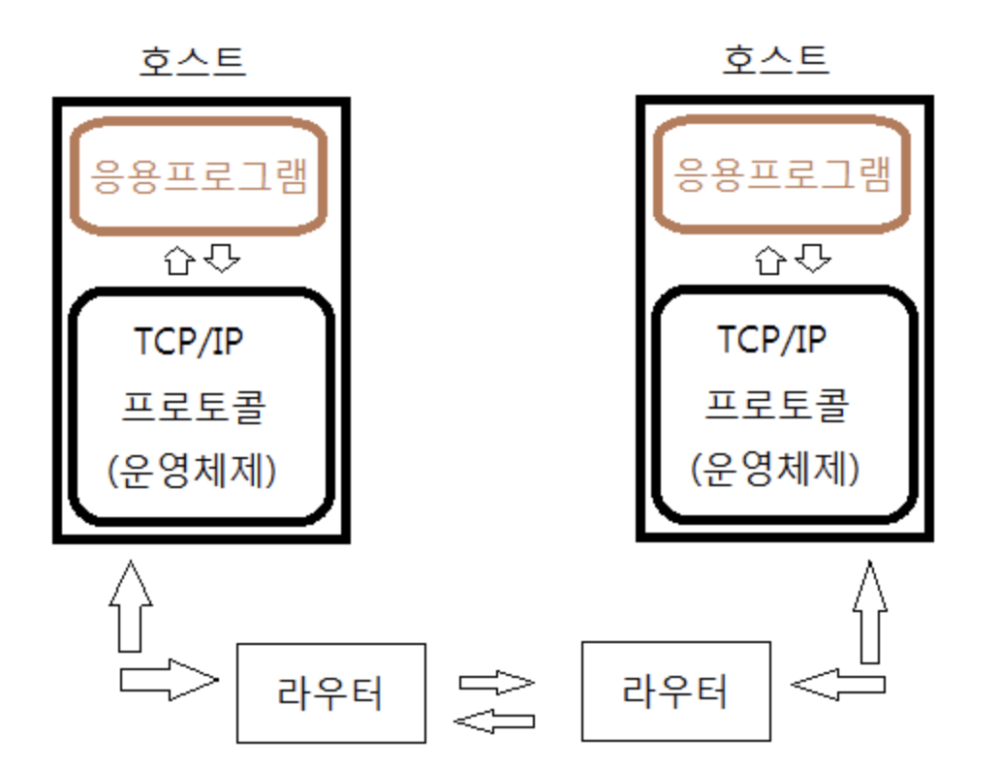
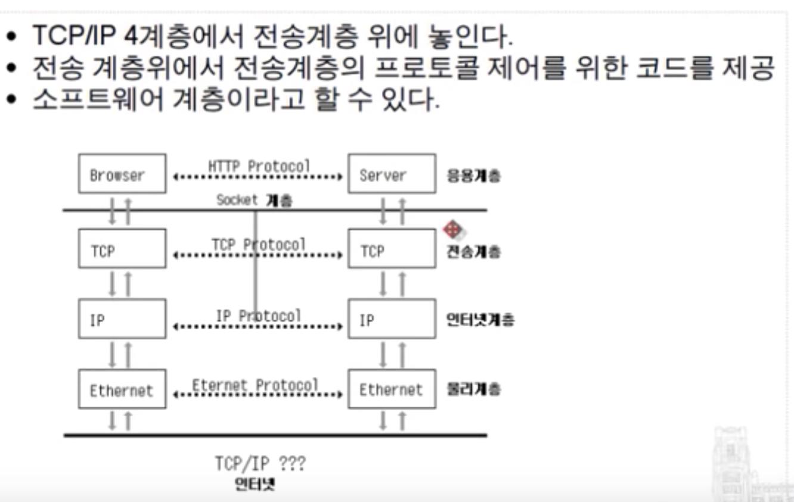
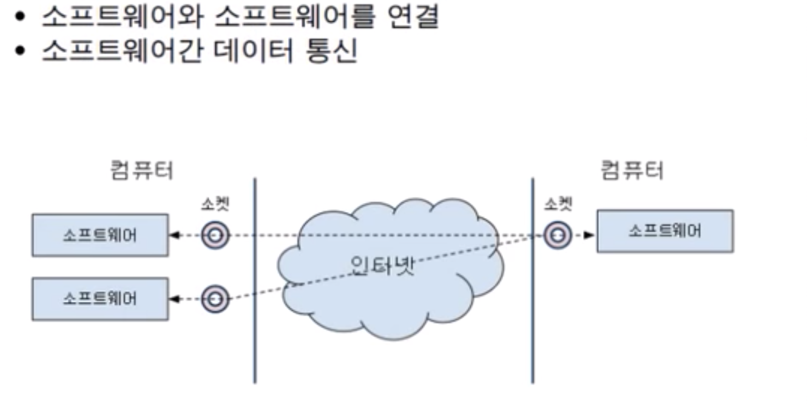
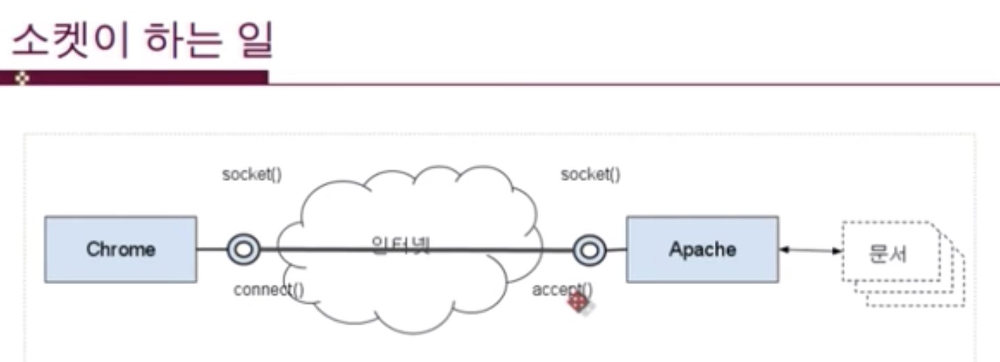

# Socket, WebSocket, Http

### Socket

두 프로그램이 네트워크를 통해 서로 통신을 수행할 수 있도록 양쪽에 생성되는 링크의 단자입니다.
두 소켓이 연결되면 서로 다른 프로세스끼리 데이터를 전달할 수 있습니다.
결국 소켓이 구현됨으로써 네트워크 및 전송 계층의 캡슐화가 가능해집니다. 
소켓은 원래 캘리포니아 버클리 대학 분교에서 UNIX용으로 개발되었으며, 
UNIX에서의 입출력 메소드의 표준인 개방/읽기/쓰기/닫기 메커니즘을 따릅니다. 

기본적으로 소켓은 통신을 위한 일종의 통로라고 생각할 수 있습니다. 기본적으로 소켓은 상대방에게
데이터를 보내거나 받는 역할을 하며, 연결을 수동적으로 기다리느냐 , 능동적으로 연결을 하느냐로!!
[ 서버 ] 냐 [ 클라이언트] 냐 구분할 수 있습니다.
(기능상 이런거지 서버와 클라이언트의 정의는 아닙니다.)

실용적인 관점에서 
소켓은 TCP(Transmission Control Protocol)와 UDP(User Datagram Protocol)로
구분할 수 있습니다. 약간은 상반되는 장점과 단점을 가지고 있으며, 어떤 것을 적절하게 활용하느냐가 전체적인 서능에 큰 영향을 주게 됩니다. 
간단하게 요약하면 ,  
TCP는 신뢰할 수 잇는 통신을 / UDP는 몇가지 신뢰도는 포기하되 좀더 직접적인 통신을 한다는 의미입니다.
그리고 다른 관점에서 소켓 함수는 동기모드(블록킹) / 비동기 모드 (논블록킹)으로 동작합니다.
차이점은 만약 데이터가 도착하지 않는 상태에서 recv()로 데이터를 수신하고자 했을 때 데이터가 올 때까지 대기(block)하느냐 , 그냥 수신된 데이터가 없다는 정보만 리턴하고 넘어가느냐 입니다.
실제로 대기한다는 의미는 시스템을 멈추고 기다린다는 것이 아니라 다른 쓰레드나 
프로세스(process)로 실행 권을 넘기는 것이기 때문에 프로세서는 항상 적절한 동작을 하게 됩니다.
비동기 모드로 데이터가 올 떄까지 풀링(polling)하면서 대기하는 것과는 기다린다는 의미에서는 동일하지만 프로세서를 활용한다는 면에서는 하늘과 땅 차이라고 할 수 있습니다.
이런 병렬적인 처리에 대한 고려가 필요하게 됩니다.
그리고 직접적인 소켓 통신을 처리하는 함수는 아니지만 소켓 처리에 대해서 Multiplex처리(하나의 쓰레드, 혹은 적은 수의 쓰레드에서 여러 개의 소켓을 처리)를 해주는 select , epoll , IOCP 같은 기능적인 함수군도 염두해 두어야겠습니다.

​
### Socket 구조

클라이언트 어플리케이션은 서버와 통신을 하기위해 어떠한 메시지 또는 데이터를 서버에게 보내려 할 것 입니다. 그러하기 위해서는 네트워크에 연결하여 서버에 접속하여야 합니다. 그러기 위해서는 소켓을 통하여 네트워크에 접속하여야 합니다.
소켓은 이렇게 어플리케이션에게 네트워크 접속을 위한 연결장치, 인터페이스 역할을 하는것입니다. 네트워크 어플리케이션이 보낸 데이터를 소켓을 거쳐 운영체제상에 존재하는 TCP/IP 소프웨어에게 전달하게 됩니다. 다시 하드웨어 상인 랜카드를 거쳐 네트워크에 전달하게 됩니다. 서버의 경우는 클라이언트와 정 반대되는 개념입니다. 네트워크는 서버에게 보낸데이터를 서버의 랜카드에게 보내지게 됩니다. 다시 운영체제의 TCP/IP소프트웨어를 거쳐 어플리케이션과 연결개념인 소켓을 통해 최종적으로 서버 어플리케이션에게 전달되는것입니다.소켓은 이렇게 어플리케이션과 TCP/IP 사이에 존재 하고 있습니다.

소켓은 시스템내에 내장 되어 있기 때문에 운영체제에 종속적이다. 
그렇기 때문에 HTML5,자바,윈도우,리눅스용 소켓 API가 모두 다르지만 개념은 똑같다.
유닉스,자바가 api가 많고 윈도우,html5는 api가 작다.

### 포트와 socket

소켓은 어플리케이션에 종속적이다. 
네트워크를통해 데이터를 주고받고 하려면 소켓을 만들어줘야 하고, 한 어플리케이션에 여러개의 소켓을 만들 수 있다.
포트(항구)는 용도에 따라서 미리 정해져있고 따로 막 새로 만들기가 어렵다.(포트번호가 용도에 따라 미리 정해져있다.)
->국제선,국내선,부산 항구 등등..
소켓은 그냥 만들면 된다.
IP Address -> port num -> socket

### 소켓의 종류

[소켓의 종류] 스트림 (TCP)

스트림 소켓은 양뱡향으로 바이트 스트림을 전송할 수 있는 연결 지향형 소켓으로 양쪽 어플리케이션이 모두 데이터를 주고받을 수 있습니다.

스트림 소켓은 오류수정 , 정송처리 , 흐름제어등을 보장해 주며 송신된 순서에 따른 중복되지 않은 데이터를 수신하게 됩니다. 이 소켓은 각 메시지를 보내기 위해 별도의 연결을 맺는 행위를 하므로 약간의 오버헤드가 존재합니다. 그러므로 소량의 데이터보다는 대량의 데이터를 보내는 경우에 적당합니다. 스트림 소켓은 이러한 품질의 통신을 수행하기 위해서 TCP를 사용합니다.

 [소켓의 종류] 데이터그램 (UDP)

 명시적으로 연결을 맺지 않으므로 비 연결형 소켓이라고 합니다. 메시지는 대상 소켓으로 전송되며 대상 소켓은 메시지를 적절히 수신합니다. 스트림 소켓을 사용하는 것이 데이터그램 소켓을 사용하는 것보다 신뢰성이 높은 방법이지만 연결을 수립하는데 드는 오버헤드는 무시할 수 없습니다.

데이터그램 소켓을 사용하려면 클라이언트에서 서버로 데이터를 전송할 때 UDP를 사용합니다.

이 프로토콜에서는 메시지의 크기에 약간의 제한이 있으며 메시지의 확실한 전달 역시 보장하지 않으며 통신 중 데이터를 잃어버려도 오류가 발생하지 않습니다.

 [소켓의 종류] RAW

 RAW소켓은 패킷을 가져오면 TCP/IP 스택상의 TCP,UDP 계층을 우회하여 바로 어플리케이션으로 송신하는 소켓입니다. 이런 소켓에서 패킷은 TCP/UDP필터를 통해 전달되지 않으므로 원형 그대로의 패킷을 볼 수 있습니다. 이것의 의미는, 모든 데이터를 적절히 처리하거나 헤더를 제거하고 이를 파싱하는 과정을 모두 수신 어플리케이션에서 담당해야 합니다.

실제 RAW소켓을 이용하여 프로그래밍을 하는 일은 거의 드물며 만약 시스템 소프트웨어나 패킷을 분석하는 프로그램을 개발할 경우 필요할 수도 있습니다.

<한빛미디어 소켓 강의>

네트워크 개발자는  tcp/ip 4계층에서만 개발을 함으로 여기서만 설명을 하겠습니다.

4계층에서 네트워크 개발자는 전송계층 위에있는 프로토콜만 신경쓰면 된다.
(TCP , UDP를 말하는 것이다.)

소켓은 함수의 몸 라이브러리지만 그림처럼 전송계층 위에 놓이기 때문에 때떄로
소켓 계층이라고 설명하기도 하다. 가끔은 인터넷 계층까지 직접 조작해야 하는 경우도 생긴다.

<소켓이 하는 일>

웹은 클라이언트 프로그램(chrome,등등)과 서버 프로그램(apache, nginx) 으로 이루어져 있다.

여기에 인터넷을 두고 사이에 떨어져 있다. 크롬 브라우저를 사용하는 이유는 인터넷 넘어에 문서를 보기 위해서 이다. 아파치 웹서버는 웹브라우저가 요청하는 문서를 전송해주는 역할을 한다.  

그러나 인터넷이 가로막고 있다. 이런 상태에서는 데이터 전송이 불가능 한다.
그래서 소켓(socket api에서 제공하는 )을 만들어서 생성을 하고 이 소켓은 브라우저와 인터넷을 연결해주는 역할을 하고 connect와 accept를 통해서 소켓과 소켓을 연결하게 된다.

출처: https://simsimjae.tistory.com/48 [104%]
출처: https://popbox.tistory.com/66