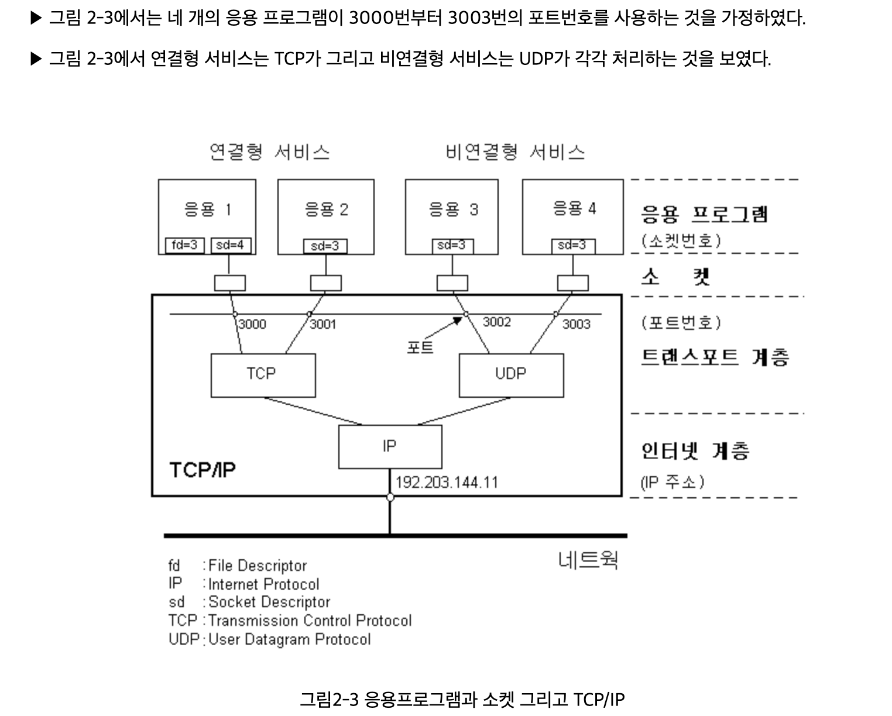
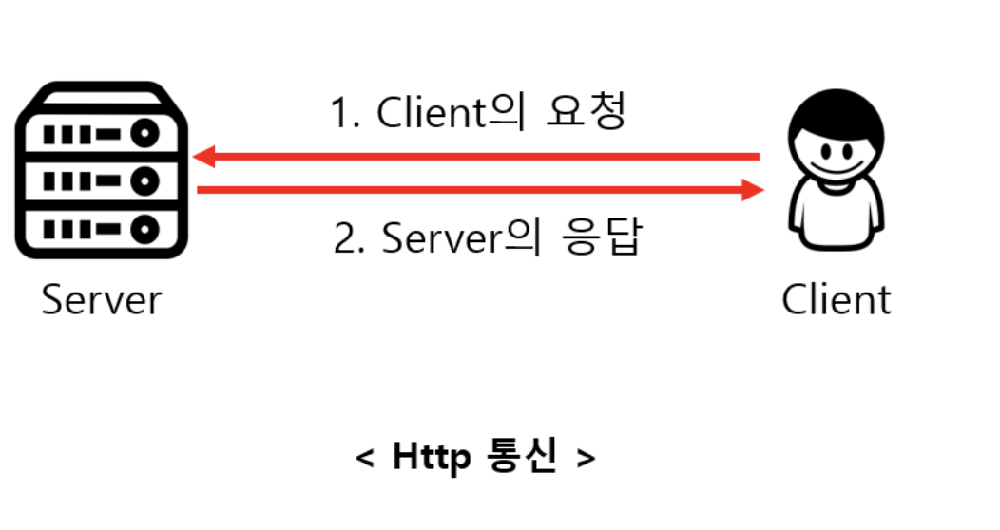
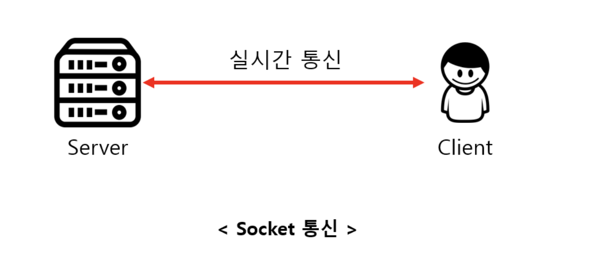
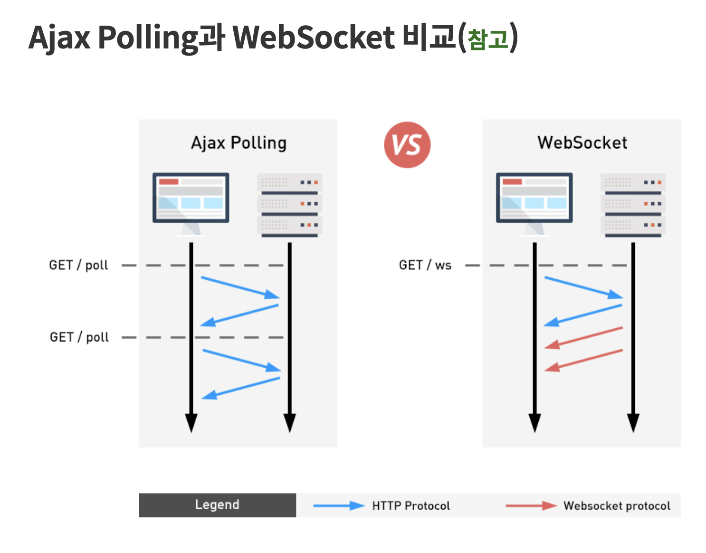

# Socket, WebSocket, Http

### Socket

두 프로그램이 네트워크를 통해 서로 통신을 수행할 수 있도록 양쪽에 생성되는 링크의 단자입니다.
두 소켓이 연결되면 서로 다른 프로세스끼리 데이터를 전달할 수 있습니다.
결국 소켓이 구현됨으로써 네트워크 및 전송 계층의 캡슐화가 가능해집니다. 
소켓은 원래 캘리포니아 버클리 대학 분교에서 UNIX용으로 개발되었으며, 
UNIX에서의 입출력 메소드의 표준인 개방/읽기/쓰기/닫기 메커니즘을 따릅니다. 

기본적으로 소켓은 통신을 위한 일종의 통로라고 생각할 수 있습니다. 기본적으로 소켓은 상대방에게
데이터를 보내거나 받는 역할을 하며, 연결을 수동적으로 기다리느냐 , 능동적으로 연결을 하느냐로!!
[ 서버 ] 냐 [ 클라이언트] 냐 구분할 수 있습니다.
(기능상 이런거지 서버와 클라이언트의 정의는 아닙니다.)

실용적인 관점에서 
소켓은 TCP(Transmission Control Protocol)와 UDP(User Datagram Protocol)로
구분할 수 있습니다. 약간은 상반되는 장점과 단점을 가지고 있으며, 어떤 것을 적절하게 활용하느냐가 전체적인 서능에 큰 영향을 주게 됩니다. 
간단하게 요약하면 ,  
TCP는 신뢰할 수 잇는 통신을 / UDP는 몇가지 신뢰도는 포기하되 좀더 직접적인 통신을 한다는 의미입니다.
그리고 다른 관점에서 소켓 함수는 동기모드(블록킹) / 비동기 모드 (논블록킹)으로 동작합니다.
차이점은 만약 데이터가 도착하지 않는 상태에서 recv()로 데이터를 수신하고자 했을 때 데이터가 올 때까지 대기(block)하느냐 , 그냥 수신된 데이터가 없다는 정보만 리턴하고 넘어가느냐 입니다.
실제로 대기한다는 의미는 시스템을 멈추고 기다린다는 것이 아니라 다른 쓰레드나 
프로세스(process)로 실행 권을 넘기는 것이기 때문에 프로세서는 항상 적절한 동작을 하게 됩니다.
비동기 모드로 데이터가 올 떄까지 풀링(polling)하면서 대기하는 것과는 기다린다는 의미에서는 동일하지만 프로세서를 활용한다는 면에서는 하늘과 땅 차이라고 할 수 있습니다.
이런 병렬적인 처리에 대한 고려가 필요하게 됩니다.
그리고 직접적인 소켓 통신을 처리하는 함수는 아니지만 소켓 처리에 대해서 Multiplex처리(하나의 쓰레드, 혹은 적은 수의 쓰레드에서 여러 개의 소켓을 처리)를 해주는 select , epoll , IOCP 같은 기능적인 함수군도 염두해 두어야겠습니다.

​
### Socket 구조

클라이언트 어플리케이션은 서버와 통신을 하기위해 어떠한 메시지 또는 데이터를 서버에게 보내려 할 것 입니다. 그러하기 위해서는 네트워크에 연결하여 서버에 접속하여야 합니다. 그러기 위해서는 소켓을 통하여 네트워크에 접속하여야 합니다.
소켓은 이렇게 어플리케이션에게 네트워크 접속을 위한 연결장치, 인터페이스 역할을 하는것입니다. 네트워크 어플리케이션이 보낸 데이터를 소켓을 거쳐 운영체제상에 존재하는 TCP/IP 소프웨어에게 전달하게 됩니다. 다시 하드웨어 상인 랜카드를 거쳐 네트워크에 전달하게 됩니다. 서버의 경우는 클라이언트와 정 반대되는 개념입니다. 네트워크는 서버에게 보낸데이터를 서버의 랜카드에게 보내지게 됩니다. 다시 운영체제의 TCP/IP소프트웨어를 거쳐 어플리케이션과 연결개념인 소켓을 통해 최종적으로 서버 어플리케이션에게 전달되는것입니다.소켓은 이렇게 어플리케이션과 TCP/IP 사이에 존재 하고 있습니다.

소켓은 시스템내에 내장 되어 있기 때문에 운영체제에 종속적이다. 
그렇기 때문에 HTML5,자바,윈도우,리눅스용 소켓 API가 모두 다르지만 개념은 똑같다.
유닉스,자바가 api가 많고 윈도우,html5는 api가 작다.

### 포트와 socket

소켓은 어플리케이션에 종속적이다. 
네트워크를통해 데이터를 주고받고 하려면 소켓을 만들어줘야 하고, 한 어플리케이션에 여러개의 소켓을 만들 수 있다.
포트(항구)는 용도에 따라서 미리 정해져있고 따로 막 새로 만들기가 어렵다.(포트번호가 용도에 따라 미리 정해져있다.)
->국제선,국내선,부산 항구 등등..
소켓은 그냥 만들면 된다.
IP Address -> port num -> socket

### 소켓의 종류

[소켓의 종류] 스트림 (TCP)

스트림 소켓은 양뱡향으로 바이트 스트림을 전송할 수 있는 연결 지향형 소켓으로 양쪽 어플리케이션이 모두 데이터를 주고받을 수 있습니다.

스트림 소켓은 오류수정 , 정송처리 , 흐름제어등을 보장해 주며 송신된 순서에 따른 중복되지 않은 데이터를 수신하게 됩니다. 이 소켓은 각 메시지를 보내기 위해 별도의 연결을 맺는 행위를 하므로 약간의 오버헤드가 존재합니다. 그러므로 소량의 데이터보다는 대량의 데이터를 보내는 경우에 적당합니다. 스트림 소켓은 이러한 품질의 통신을 수행하기 위해서 TCP를 사용합니다.

 [소켓의 종류] 데이터그램 (UDP)

 명시적으로 연결을 맺지 않으므로 비 연결형 소켓이라고 합니다. 메시지는 대상 소켓으로 전송되며 대상 소켓은 메시지를 적절히 수신합니다. 스트림 소켓을 사용하는 것이 데이터그램 소켓을 사용하는 것보다 신뢰성이 높은 방법이지만 연결을 수립하는데 드는 오버헤드는 무시할 수 없습니다.

데이터그램 소켓을 사용하려면 클라이언트에서 서버로 데이터를 전송할 때 UDP를 사용합니다.

이 프로토콜에서는 메시지의 크기에 약간의 제한이 있으며 메시지의 확실한 전달 역시 보장하지 않으며 통신 중 데이터를 잃어버려도 오류가 발생하지 않습니다.

 [소켓의 종류] RAW

 RAW소켓은 패킷을 가져오면 TCP/IP 스택상의 TCP,UDP 계층을 우회하여 바로 어플리케이션으로 송신하는 소켓입니다. 이런 소켓에서 패킷은 TCP/UDP필터를 통해 전달되지 않으므로 원형 그대로의 패킷을 볼 수 있습니다. 이것의 의미는, 모든 데이터를 적절히 처리하거나 헤더를 제거하고 이를 파싱하는 과정을 모두 수신 어플리케이션에서 담당해야 합니다.

실제 RAW소켓을 이용하여 프로그래밍을 하는 일은 거의 드물며 만약 시스템 소프트웨어나 패킷을 분석하는 프로그램을 개발할 경우 필요할 수도 있습니다.

<한빛미디어 소켓 강의>

네트워크 개발자는  tcp/ip 4계층에서만 개발을 함으로 여기서만 설명을 하겠습니다.

4계층에서 네트워크 개발자는 전송계층 위에있는 프로토콜만 신경쓰면 된다.
(TCP , UDP를 말하는 것이다.)

소켓은 함수의 몸 라이브러리지만 그림처럼 전송계층 위에 놓이기 때문에 때떄로
소켓 계층이라고 설명하기도 하다. 가끔은 인터넷 계층까지 직접 조작해야 하는 경우도 생긴다.

<소켓이 하는 일>

웹은 클라이언트 프로그램(chrome,등등)과 서버 프로그램(apache, nginx) 으로 이루어져 있다.

여기에 인터넷을 두고 사이에 떨어져 있다. 크롬 브라우저를 사용하는 이유는 인터넷 넘어에 문서를 보기 위해서 이다. 아파치 웹서버는 웹브라우저가 요청하는 문서를 전송해주는 역할을 한다.  

그러나 인터넷이 가로막고 있다. 이런 상태에서는 데이터 전송이 불가능 한다.
그래서 소켓(socket api에서 제공하는 )을 만들어서 생성을 하고 이 소켓은 브라우저와 인터넷을 연결해주는 역할을 하고 connect와 accept를 통해서 소켓과 소켓을 연결하게 된다.

### http 통신

   - Client의 요청(Request)이 있을 때만 서버가 응답(Response)하여 해당 정보를 전송하고 곧바로 연결을 종료하는 방식  

Http통신은 Client의 요청이 있을 때만 Server가 응답하여 처리를 한 후에 연결을 끊는 방식입니다. 이러한 연결 방식은 Client가 요청을 보내는 경우에만 Server가 응답하는 단방향적 통신으로, Server가 Client로 요청을 보낼수는 없습니다. 이해를 돕기 위해 여러분들이 이 글을 보기 위해 블로그에 들어오는 상황을 예로 들어보겠습니다. 여러분들이 이 글을 위한 링크를 클릭한 순간에 Client(웹)는 Server(웹서버)로 이 글에 대한 내용을 보내달라고 요청을 한 것입니다. 이 글에 대한 내용들을 받은 후에는 바로 연결이 종료됩니다. 그렇기 때문에 요청을 보낼때, 내용을 기다리는 시간과 함께 연결하는 시간이 들어가게 됩니다. 이러한 Http 통신은 실시간 연결이 아닌, 필요한 경우에만 Server로 접근하는 콘텐츠 위주의 데이터를 사용할 때 용이합니다. 만약 게시물에 대한 내용을 요청하기 위해 실시간으로 연결을 유지하는 Socket통신을 사용하게 되면, 게시물을 받은 후에도 계속 통신을 위한 연결이 성립되어 있어 부하가 걸리게 됩니다. 일반적으로 모바일 어플리케이션은 필요한 경우에만 Server로 정보를 요청하는 경우가 많은데, 이러한 Web Server로 Http 통신을 주로 사용하며 비용 및 유지보수 등 대부분의 방면에서 좋다.

[특징]

   - Client가 요청을 보내는 경우에만 Server가 응답하는 단방향 통신이다.
   - Server로부터 응답을 받은 후에는 연결이 바로 종료된다. 
   - 실시간 연결이 아니고, 필요한 경우에만 Server로 요청을 보내는 상황에 유용하다.
   - 요청을 보내 Server의 응답을 기다리는 어플리케이션(Android or Ios)의 개발에 주로 사용된다

### socket 통신
   -  Server와 Client가 특정 Port를 통해 실시간으로 양방향 통신을 하는 방식  

Socket통신은 Http 통신과 달리 Server와 Client가 특정 Port를 통해 연결을 성립하고 있어 실시간으로 양방향 통신을 하는 방식입니다. Client만 필요한 경우에 요청을 보내는 Http 통신과 달리 Socket 통신은 Server 역시 Client로 요청을 보낼 수 있으며, 계속 연결을 유지하는 연결지향형 통신이기 때문에 실시간 통신이 필요한 경우에 자주 사용됩니다. 예를 들면, 실시간 Streaming 중계나 실시간 채팅과 같이 즉각적으로 정보를 주고받는 경우에 사용합니다. 예를 들어 실시간 동영상 Streaming 서비스를 Http 통신으로 구현하였다고 가정하겠습니다. 이러한 경우에 사용자가 서버로 동영상을 요청하기 위해서는 동영상이 종료되는 순간까지 계속해서 Http 통신을 보내야 하고 이러한 구조는 계속 연결을 요청하기 때문에 부하가 걸리게 됩니다. 그러므로 이러한 경우에는 Socket을 통해 구현하는 것이 적합합니다. 

[특징]
   - Server와 Client가 계속 연결을 유지하는 양방향 통신이다.

   - Server와 Client가 실시간으로 데이터를 주고받는 상황이 필요한 경우에 사용된다.

   - 실시간 동영상 Streaming이나 온라인 게임 등과 같은 경우에 자주 사용된다.

### websocket 통신

WebSocket은 클라이언트(웹 브라우저)와 서버(웹 서버)가 양방향 통신하는 것을 말합니다.

사용 방법으로는 Ajax와 비슷하지만 개념 면에서 Ajax와 차이를 두고 있습니다. Ajax의 경우는 웹 브라우저에서 데이터를 호출하면 웹 서버에서 호출된 값을 검색, 작성해서 웹 브라우저로 메시지를 보내는 형식의 구조라면 웹 소켓의 경우는 웹 브라우저에서 호출해서 데이터를 가져가는 기능 포함 반대로 서버에서 클라이언트를 호출할 수 있는 기능까지 있습니다.

예로 채팅프로그램을 만든다고 가정할 때 우리가 채팅 글을 써서 서버로 보내는 건 가능합니다. 그러나 Ajax로 만든 웹 페이지라면 서버 측에서 클라이언트로 보낸 수가 없으므로 대응책으로는 10초마다 데이터를 데이터 갱신을 통해서 데이터를 확인하루 수 있지만 웹 소켓은 서버에서도 클라이언트를 인지를 하는 상태이기에 양방향 통신이 가능합니다.

웹소켓의 경우는 HTML 5.0부터 표준이 되고 사용 프로토콜 형태는 ws://~~~ 형태로 사용합니다.

현재는 websocket의 서버부하, 보안(Security)적인 측면과 세션 관리 등의 여러 가지 문제를 가지고 있고 가장 큰 단점으로 구 브라우저(IE 8.0)에서는 작동하지 않는 문제점이 있습니다. 

기존 웹 페이지의 전형적인 브라우저 통신 및 랜더링 방식은 HTTP(요청,응답)을 사용한 방식이다. 하지만 websocket은 새로운 데이터를 받아서 DOM을 다시 랜더링 하거나 또는 브라우저를 새로고침하여 전체를 랜더링 해서 클라이언트 브라우저에 표현하는 방식이다.

원하는 부분만 실시간으로 상호 데이터를 교환하여 새로고침 없이 랜더링하는 기술로 발전하면서 비동기 통신이라는 기술을 많이 사용하고 있으며, 그 보다 더욱 효과적으로 실시간 데이터 처리 및 랜더링을 위해서 RIA(Rich Internet Application) 기술이 발달되고 있습니다.

위와 같은 맥락에서 클라이언트 브라우저와 웹 서버 사이에서 양방향 메시지 송수신 기술인 HTML5WebSocket 기술이 등장하게 되었다고 볼 수 있습니다.

여기서 질문 그러면 여기서 ajax랑 차이가 무엇일까??

위 그림에서 핵심적으로 이해하실 수 있는 사실은 기존 요청응답관계에서 벗어난 양방향 자유로운 송수신을 지원한다는 점이 가장 큰 메리트라고 볼 수 있다.

아울러, 요즘 화두가 되고 있는 가상화폐 거래소 등을 방문해 보시면 실시간으로 수 많은데이터 양방향 처리를 위해 대부분은 websocket 프로토콜을 사용해서 구현해놓은 것을 확인 하실수 있다.

JAX는 HTTP의 한계성(지속적인 연결(persistent connection)의 불가능)을 극복하고자 나타난 기술(개념)이다.

일반적으로 웹의 프로토콜은(HTTP,HTTPS) 클라이언트(웹 브라우저)에서 서버에 요청을 요구해야지 서버에서 반응하여 응답을 통해 화면이 출력이 되는데, 이 방법은 실시간으로 데이터를 갱신하거나 인터렉티브한 동적인 웹서비스를 구현하기엔 불가능한 요소로 작용된다.

예를 들면 실시간으로 정보를 확인해야하는 대시보드(예: 스포츠 중계, 보안 관제서비스)의 경우 실시간으로 데이터가 재갱신(Refresh,Reload)가 자주 일어나야 하므로 기존의 방법으로는 많은 문제들에 부딪치게 된다.

 

이러한 문제를 해결하고자 세계각지의 개발자들은 여러가지 방법(혹은 편법)을 고안해내기 시작했고 이를 우리는 코멧(Comet)이라고 부르며ㅡ, 또는 Ajax(혹은 Reverse Ajax, Ajax Push)라고 얘기를 하곤 한다.

Ajax는 일반적으로 폴링방식과, 롱폴링, 스트리밍 방식이 있다.

#폴링(Polling)

폴링 방식은 화면을 업데이트 하는 함수를 작성하고 일성 시간마다 setInterval() 함수를 통하여 업데이트 함수를 호출하는 방법.

#롱 폴링(Long Polling)

롤폴링 방식은, 문자 그대로 오래 끌기라는 개념을 가지고 있다. 클라이언트에서 서버에 응답이 올 때까지 접속을 계속 유지(Long Polling)하며, 

응답이 오면 응답 내용(데이터)를 처리함과 동시에 방금 끊어지는 접속을 다시 유지하기 위한 새로운 코드를 작성해서 접속을 유지하는 방식.

쉽게 말하면 계속해서 대기+종료생성 / 대기+종료생성을 끝없이 한다고 보면 된다.

즉, 응답을 기다리다가, 데이터 응답과 동시에 다시 새접속을 만드는 것이라고 볼 수 있다.

#WebSocket(WebSocket API)

웹소켓은 HTML5에서 생긴 기술로, 문자 그대로 웹에서 사용하기 위한 소켓을 의미한다. 

AJAX로도 비동기가 가능하다곤 하지만 결국 이는 편법에 불가한 방법이고, 근본적인 해결책이 아니기 때문에 자연스레 생긴 기술이다.

이 웹소켓 기술을 사용하면 아무런 제약없이 클라이언트와 서버가 통신을 할 수 있다. 이는 일방적인 서버에서의 PUSH도 가능해진다는 얘기.

코멧처럼 무한루프를 돌리지 않아도 되고, 특정 시간마다 호출하지 않아도 된다. 또한 AJAX에는 정말 중대한 단점이 있는 데, 데이터의 과부하적인 측면이 있어 실사용에 많은 문제점이 있다.

AJAX는 요청과 응답이 계속 있는 형태이므로, 순수한 데이터로 응답이 되는 것이 아니라 Content-Type 즉 컨텐츠 헤더가 묻어서 응답이 이루어지는 데, 예를 들면 단순히 1에서 999까지의 숫자를 순서대로 실시간으로 업데이트 하는 화면이 있다고 가정하면, 1이라는 문자에는 이게 html 문서인지, json 데이터인지, 어플리케이션 데이터(다운로드 대상)인지를 알려주는 컨텐츠 헤더정보가 같이 묻어서 응답되어지기 때문에

1 + Contetns-header, 2 + Contetns-header, 3 + Contetns-header ... 999 + Contetns-header 란 식으로 쓸데없는 더미 트래픽이 계속 발생하는 문제점이 있다.

일반 유선으로 연결되어진 PC환경에서야 상관없지만, 다중 접속이 이루어지는 서비스나 모바일컨텐츠가 주를 이루는 서비스라면 많은 문제가 될 수 있는 상황.

웹 소켓은 이러한 문제없이 단순한 순수 데이터만 전송이 가능해진다.

사실 이것도 헤더 캐싱이라 해서, 쿠키와 같은 개념으로 관리를 하면 절약할 수는 있다.

하지만 아무리 그래도 header의 오버헤드 자체는 해결 할 수 없다.

위의 AJAX 예와는 달리 웹소켓으로는 1, 2, 3,  ... 999 의 순수한 데이터 전송이 가능하다.

왜냐면 요청한 클라이언트와 응답할 서버 그들만의 소켓이기 떄문에,  HTTP프로토콜 자체는 정보전달을 특정 대상 구분 없이 전송할 목적으로 만들어졌기 때문에 이 데이터가 문서인지, 어플리케이션인지에 대한 정보가 항상 들어있어야 하지만 그들만의 통신소켓에서는 굳이 이를 알려줄 필요가 없기 때문이다.

다만, 이러한 장점이 많은 웹소켓도 단점이 있다. 최신 기술이 모두 그러하듯 바로 기존 인프라에 탑재되어 있는 구버전의 브라우저에는 호환이 되지 않는 다는 점.

<메모>
TCP : 전화
UDP : 편지
동기 : 동시에 발생하는 것 (데이터를 보내고 응답이 올 때까지 대기)
비동기 : 동시에 발생하지 않는 것 (데이터를 보내고 바로 다음 행동하고, 응답이 왔을 때 할 행동을 따로 작성해서 응답오면 그 행동 처리)

TCP vs UDP

TCP통신 :
■ 전화와 마찬가지로 전화를 걸고 끊기 전까지는 계속해서 통신을 할 수 있다.
■ 양방향 모두 가능하다.
■ 데이터의 확인 절차도 거치게 된다.

UDP통신 :
■ 메시지가 제대로 도착했는지 확인하는 확인응답을 사용하지 않는다.
■ 수신된 메시지의 순서를 맞추지 않으며, 기계간의 정보흐름 속도를 제어하지 않는다.
■ 메시지는 손실되거나 중복되거나 비 순서적으로 도착할 수 있다.

 
출처: https://simsimjae.tistory.com/48 [104%]
출처: https://popbox.tistory.com/66
출처: http://jkkang.net/unix/netprg/chap2/net2_1.html
출처: https://iamawebdeveloper.tistory.com/85
출처: https://glqdlt.tistory.com/145