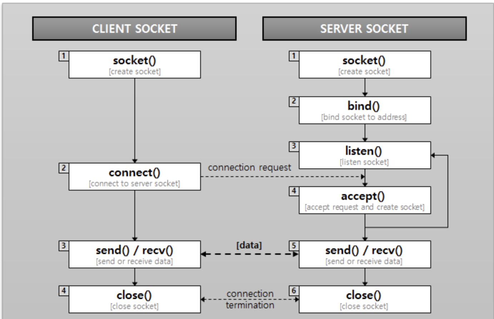

# 웹 통신 흐름
  

<!-- -->

spring 이란 무엇인가
이번에 생일을 기념해서 큰맘먹고 토비의 스프링책을 샀다.

물론 자바 스프링 웹개발자라면 사는 시기가 늦었다고 볼수도 있겠다

무튼 토비의 스프링을 샀고 앞으로 블로그로 로그를 남기면서 작성하면 나에게 남는게 많을거라 생각해서 로그를 남기게 되었다.

스프링이란 무엇인가?
스프링은 자바 EE 애플리케이션 개발에 사용되는 프레임워크이다. 

스프링 프레임워크는 애플리케이션 개발을 빠르고 효과적으로 만들 수 있게 여러가지 기술을 제공한다.

스프링 프레임워크
스프링 프레임워크의 기본적인 구조는 크게 3가지로 나뉜다.

1. 스프링 컨테이너
스프링은 스프링 컨테이너 또는 애플리케이션 컨택스트라고 불리는 스프링 런타임 엔진을 제공한다.

스프링의 설정정보를 참고로 해서 애플리케이션을 구성하는 오브젝트를 생성하고 관리한다. 스프링 컨테이너는 독립적으로 동작할 수도 있지만 보통 웹 모듈에서 동작하는 서비스나 서블릿으로 등록해서 사용한다.

2. 프로그래밍 모델 IoC/DI , 서비스 추상화, AOP

ioC/DI 

오브젝트의 생명주기와 의존관계에 대한 프로그래밍 모델이다. 스프링은 다음 기술을 핵심으로 삼고 있는데 스프링 프레임워크에서 동작하는 코드는 IoC/DI 방식을 따라서 작성돼야 스프링이 제공하는 가치를 제대로 누릴 수 있다. 스프링이 직접 제공하는 모든 기술과 API, 심지어 컨테이너도 모두 IoC/DI 방식으로 작성되어 있다.

서비스 추상화

스프링을 사용하면 환경이나 서버, 특정 기술에 종속되지 않고 이식성이 뛰어나며 유연한 애플리케이션을 만들 수 있는데 이를 가능하게 해주는 것이 서비스 추상화이다. 구체적인 환경에 종속되지 않도록 유연한 추상 계층을 두는 방법이다.

AOP

AOP는 애플리케이션 코드에 산재해서 나타나는 부가적인 기능을 독립적으로 모듈화하는 프로그래밍 모델이다. 스프링은 AOP를 이용해서, 다양한 앤터프라이즈 서비스를 적용하고도 깔끔한 코드를 유지할 수 있게 해준다. 

3. API
스프링은 앤터프라이즈 애플리케이션을 개발의 다양한 영역에 바로 활용할 수 있는 방대한 양의 기술 API를 제공한다. UI작성은 물론이고 웹 프레젠테이션 계층, 비즈니스 서비스 계층, 기반 서비스 계층, 도메인 계층, 데이터 액세스 계층 등에서 필요한 주요 기술을 스프링에서 일관된 방식으로 사용할 수 있도록 지원해주는 기능과 전략 클래스등을 제공한다.

  

- 출처 : https://github.com/JaeYeopHan/Interview_Question_for_Beginner/blob/master/Network/README.md#%EC%9B%B9-%ED%86%B5%EC%8B%A0%EC%9D%98-%ED%81%B0-%ED%9D%90%EB%A6%84