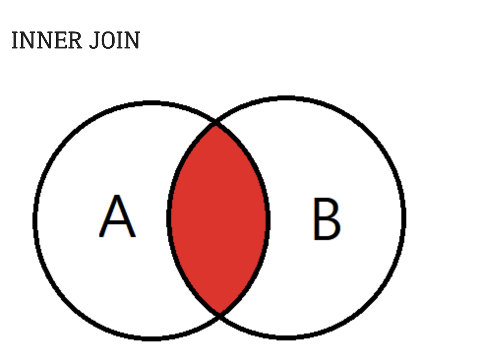

# SELECT 연습

   - union find?? 어디??

order by

Select 문을 사용할때 출력되는 결과물은 테이블에 입력된 순서대로 출력되는 것이 기본입니다. 하지만 우리는 가끔은 내림차순으로 혹은 오름차순으로 정렬된 데이터들이 필요할 떄가 있습니다. 이때 사용하는 것이 ORDER BY절입니다.
ORDER BY 절은 항상 SELECT 문의 맨 마지막에 위치합니다.

ex>

SELECT *
FROM table_name
ORDER BY column_name(ASC,DESC)

ASC는 오름차순이고 DESC는 내림차순입니다.

ORDER BY 같은 경우에는 열의 이름 뿐 아니라 ALIAS를 입력해도 무방합니다. 이는 ORDER BY가 퀴리문 중에 가장 나중에 실행되는 쿼리문이기 때문입니다. 또한 열의 숫자위치로 정렬하는 것도 가능하며 여러 열을 기준으로 정렬하는 것이 또한 가능합니다.

기본형태
SELECT * FROM table_name ORDER BY column_name;

ALIAS 사용
SELECT sal+ comm AS TOTAL FROM emp ORDER BY TOTAL;

열의 숫자를 사용
SELECT * FROM table_name ORDER BY 3;
3번째 열을 기준으로 정렬하는 쿼리입니다.

여러 열을 기준으로 사용
SELECT *
FROM table_name
ORDER BY 3,1 DESC;  (지금은 리미트를 한다.)

<한개만 뽑을때>
-- 코드를 입력하세요
SELECT NAME 
FROM ANIMAL_INS
ORDER BY DATETIME
LIMIT 1;

3번쨰열을 기준으로 오름차순으로 정렬한 상태에서 1번째 열을 기준으로 내림차순으로 정렬하는 쿼리입니다.

<sum,MIN,MAX>

1번

SELECT MAX(DATETIME) AS 시간
FROM ANIMAL_INS;

SELECT DATETIME AS 시간
FROM ANIMAL_INS
ORDER BY DATETIME DESC
LIMIT 1;

2번
SELECT MIN(DATETIME) AS 시간
FROM ANIMAL_INS;

SELECT DATETIME AS 시간
FROM ANIMAL_INS
ORDER BY DATETIME
LIMIT 1;

3번
-- 코드를 입력하세요
SELECT COUNT(DATETIME) as count
FROM ANIMAL_INS;

4번
중복제거 하는 방법

  SELECT DISTINCT ID, NAME
   FROM TABLE;

    SELECT count(DISTINCT NAME) as count
    FROM ANIMAL_INS

오라클(ORACLE)에서 데이터 조회 시 데이터 중복을 제거하기 위해서는 대표적으로 2가지 방법이 있다. distinct 키워드를 사용하여 중복을 제거하는 방법과, group by 절을 사용하여 데이터 중복을 제거하는 방법이다.
두가지 방법 모두 장단점이 존재한다. 
distinct 키워드를 사용하여 데이터 중복을 제거할때는 select절에 distinct 키워드만 명시하면 되므로 쿼리문이 복잡하지 않고 간결하다. 그러나 distinct를 사용시 temp tablespace에 임시로 저장하고 작업하는 방식이라 시스템에 부하를 줄 수 있다.
group by절을 이용하여 데이터 중복을 제거할때는 select절의 컬럼을 group by절에도 동일하게 명시를 해야하는 부담감이 있지만 distinct에 비하여 조금 빠른감이 있다.

-중복제거
SELECT DISTINCT (컬럼명) FROM 테이블명

-중복된 데이터 제거 후 COUNT
SELECT COUNT(DISTINCT (컬럼명)) FROM 테이블명

-중복찾기
SELECT 컬럼명 FROM 테이블명 GROUP BY 컬럼명 HAVING COUNT (컬럼명) > 1

<group by 공부>

하나, 예를 들어보겠습니다.

MySQL에서 유형별로 갯수를 가져오고 싶은데, 단순히 COUNT 함수로 데이터를 조회하면 전체 갯수만을 가져옵니다.
이렇게 유형별로 갯수를 알고 싶을 때는 컬럼에 데이터를 그룹화 할 수 있는 GROUP BY를 사용하는 것입니다.
GROUP BY를 사용할 때는 두가지를 기억해야 합니다.
특정 컬럼을 그룹화 하는 GROUP BY 
특정 컬럼을 그룹화한 결과에 조건을 거는 HAVING

-사용방법

컬럼 그룹화
SELECT 컬럼 FROM 테이블 GROUP BY 그룹화할 컬럼;

조건 처리후 컬럼 그룹화
SELECT 컬럼 FROM 테이블 WHERE 조건식 GROUP BY 그룹화할 컬럼;

컬럼 그룹화 후에 조건 처리
SELECT 컬럼 FROM 테이블 GROUP BY 그룹화할 컬럼 HAVING 조건식;

조건 처리 후에 컬럼 그룹화 후에 조건 처리
SELECT 컬럼 FROM 테이블 WHERE 조건식 GROUP BY 그룹화할 컬럼 HAVING 조건식;

ORDER BY가 존재하는 경우
SELECT 컬럼 FROM 테이블 [WHERE 조건식]
GROUP BY 그룹화할 컬럼 [HAVING 조건식] ORDER BY 컬럼1 [, 컬럼2, 컬럼3 ...];

1번
SELECT ANIMAL_TYPE, COUNT(ANIMAL_TYPE) AS count
FROM ANIMAL_INS
GROUP BY ANIMAL_TYPE
ORDER BY ANIMAL_TYPE ASC;

2번
SELECT NAME, COUNT(NAME) AS count
FROM ANIMAL_INS
GROUP BY NAME
having COUNT(NAME)> 1
ORDER BY NAME ASC;

<<주의>>
SELECT NAME, count() as 'COUNT'
FROM ANIMAL_INS
GROUP BY NAME HAVING count()>1
ORDER BY NAME ASC

count를 이렇게 주면 NULL 값이 들어갑니다.

입양 시간 구하기
SELECT HOUR(DATETIME)as HOUR,count(DATETIME) as COUNT
FROM ANIMAL_OUTS
WHERE HOUR(DATETIME) >= 9 and HOUR(DATETIME) <= 19
GROUP BY hour(DATETIME)
order by hour(DATETIME)

<NULL 값 조사하기>

이름이 없는 동물의 아이디

SELECT ANIMAL_ID
FROM ANIMAL_INS
WHERE NAME is NULL

이름이 있는 동물의 아이디

SELECT ANIMAL_ID
FROM ANIMAL_INS
WHERE NAME is not NULL

널값을 대신 처리할때는 ifnull을 사용한다.

SELECT ANIMAL_TYPE, IFNULL(NAME,'No name') as NAME, SEX_UPON_INTAKE
FROM ANIMAL_INS

<join 정리하기>
조인을 하는 이유

관계형 데이터베이스를 구축하기 위함이다. 관계형 데이터베이스의 기본은 데이터 정보를 쪼개 여러 개의 테이블에 나누어 저장하는 것이다.
이렇게 되면 데이터가 중복되는 현상을 막고, 데이터의 UPDATE시 변경의 연산이 적어지며 처리 속도 역시 빨라진다.

예를 들어, 어떤 판매자가 여러 개의 물건을 판매한다고 생각해보자.
판매자의 정보와 물건의 정보가 하나의 테이블에 나열되어 있다면, 판매하는 물건이 3개라면 판매자의 정보는 불필요하게 3번이나 들어가게 되고 또한 판매자의 정보가 수정될 경우(예를 들어 연락처 변경) 모든 행에 대해 수정 연산을 해야하므로 불필요한 연산이 많아진다.

이럴 경우 판매자 정보를 따로 테이블을 만들고, 판매자의 이름만 판매하는 물건의 테이블에 넣어 관계를 이루게 한다.

INNER JOIN(내부조인, 동등조인)

SELECT vend_name,prod_name,prod_price
FROM venders,products
WHERE vendors.vend.id=product.vend_id;

두개 이상의 테이블을 FROM을 통해서 가져오고 WHERE 절에 반드시 조인 조건을 달아주어야 한다.

SELECT vend_name,prod_name,prod_price
FROM vendors INNER JOIN products
ON venders.vend.id = products.vend_id:
ㅇ
위의 결과와 같은 값이 나온다.

테이블 이름에 대해서도 AS를 이용해서 별칠을 쓸 수 있다. 좀 더 코드를 쉽게 작성할 수 있다는 장점이 있다.

SELF JOIN
같은 테이블을 두 번 참조해야되는 경우가 있다.
예를 들어, 김철수라는 사람과 같은 회사에서 일하는 사원들 전체에게 메일을 보낼 때 김철수의 회사를 알기위해 한번 참조하고 그 회사에 다니는 사원들을 뽑아내기 위해 다시 참조해야 한다.

쉽게말해 교집합이라고 생각하시면 됩니다. 기준테이블과 Join한 테이블의 중복된 값을 보여줍니다.

결과값은 A의 테이블과 B테이블이 모두 가지고있는 데이터만 검색됩니다.

OUTER JOIN
조인을 하긴 하는데 특정 테이블의 값을 모두 출력하고 싶다. 즉, 조인이 안되는 행도 출력하고 싶다. 예를 들ㄷ어, 모든 구매자가 구매한 상품의 정보를 알고 싶은데 구매하지 않은 구매자도 나타내고 싶다.

1.LEFT JOIN
SELECT customer.cust_id,orders.order_num
FROM customers LEFT OUTER JOIN orders
ON customers.cust_id = orders.cust_id;

왼쪽 조인의 뜻은 왼쪽에 있는 테이블을 다 출력한다는 뜻이다.
그러면 구매하지 않은 구매자에 대해선 order_num이 NULL값으로 출력될 것이다.
RIGHT 조인도 있지만, 지원하지 않은 DBMS가 많고 mysql역시 지원항지 않는다. 테이블의 순서만 바뀌면 되니,LEFT조인만 사용하면 된다.

조인 & 그룹화
만약 구매자가 구매한 모든 상품의 정보가 아닌 갯수를 알고 싶다면
그렇게 된다면 구매자의 id로 그룹화를 하고 조인의 결과로 나올 order_num의 갯수를 count해주면 된다.

SELECT customer.cust_id, count(orders.order_num) AS num_ord
FROM customers INNER JOIN orders
ON customers.cust_id = orders.cust_id
GROUP BY customers.cust_id;

<JOIN>

1.없어진 기록 찾기

SELECT ANIMAL_OUTS.ANIMAL_ID,ANIMAL_OUTS.NAME
FROM ANIMAL_OUTS LEFT OUTER JOIN ANIMAL_INS
ON ANIMAL_OUTS.ANIMAL_ID = ANIMAL_INS.ANIMAL_ID
WHERE ANIMAL_INS.ANIMAL_ID IS NULL;

-- 코드를 입력하세요
select animal_id, name
 from animal_outs 
 where animal_id not in 
    (select animal_id 
    from animal_ins);

SELECT ANIMAL_INS.ANIMAL_ID, ANIMAL_INS.NAME
FROM ANIMAL_INS LEFT OUTER JOIN ANIMAL_OUTS
ON ANIMAL_INS.ANIMAL_ID = ANIMAL_OUTS.ANIMAL_ID
WHERE ANIMAL_INS.DATETIME > ANIMAL_OUTS.DATETIME
ORDER BY ANIMAL_INS.DATETIME

SELECT animal_ins.animal_id ,animal_ins.name from animal_ins inner join animal_outs 
on(animal_ins.animal_id = animal_outs.animal_id)
where  animal_outs.datetime <animal_ins.datetime
order by animal_ins.datetime

오랜 기간 보호한 동물(1)

    SELECT ANIMAL_INS.NAME,ANIMAL_INS.DATETIME
    FROM ANIMAL_INS LEFT OUTER JOIN ANIMAL_OUTS
    ON ANIMAL_INS.ANIMAL_ID = ANIMAL_OUTS.ANIMAL_ID
    WHERE ANIMAL_OUTS.DATETIME is NULL 
    ORDER BY ANIMAL_INS.DATETIME
    LIMIT 3;

    SELECT NAME, DATETIME
    FROM ANIMALINS 
    WHERE ANIMALID NOT IN 
    (SELECT s2.ANIMALID 
    FROM ANIMALINS s3 INNER JOIN ANIMALOUTS s2 
    ON s3.ANIMALID=s2.ANIMAL_ID)
    ORDER BY DATETIME
    LIMIT 3

    SELECT S1.NAME, S1.DATETIME 
    FROM ANIMALINS S1 LEFT JOIN ANIMALOUTS S2 
    ON S1.ANIMALID = S2.ANIMALID 
    WHERE ((S2.NAME IS NULL) AND (S1.NAME IS NOT NULL))
    ORDER BY DATETIME 
    LIMIT 3

    SELECT S1.NAME, S1.DATETIME
    FROM ANIMALINS S1 
    WHERE NOT EXISTS (
    SELECT S1 
    FROM ANIMALOUTS S2
    WHERE S2.ANIMALID = S1.ANIMALID)
    ORDER BY DATETIME 
    LIMIT 3

<4번 중성화>
SELECT ANIMAL_OUTS.ANIMAL_ID,ANIMAL_OUTS.ANIMAL_TYPE,ANIMAL_OUTS.NAME
FROM ANIMAL_OUTS LEFT OUTER JOIN ANIMAL_INS
ON ANIMAL_OUTS.ANIMAL_ID = ANIMAL_INS.ANIMAL_ID
WHERE ((ANIMAL_INS.SEX_UPON_INTAKE = 'Intact Female') or (ANIMAL_INS.SEX_UPON_INTAKE = 'Intact Male')) and ((ANIMAL_OUTS.SEX_UPON_OUTCOME = 'Neutered Male') or(ANIMAL_OUTS.SEX_UPON_OUTCOME = 'Spayed Female'))

-- 코드를 입력하세요
SELECT A.ANIMAL_ID AS ANIMAL_ID, A.ANIMAL_TYPE AS ANIMAL_TYPE, A.NAME AS NAME
FROM ANIMAL_INS A, ANIMAL_OUTS B
WHERE A.SEX_UPON_INTAKE LIKE('Intact%') AND A.SEX_UPON_INTAKE != B.SEX_UPON_OUTCOME
    AND A.ANIMAL_ID = B.ANIMAL_ID
ORDER BY A.ANIMAL_ID;

-- 코드를 입력하세요
SELECT a.ANIMAL_ID, a.ANIMAL_TYPE, a.NAME FROM ANIMAL_INS as a INNER JOIN ANIMAL_OUTS as b 
ON a.ANIMAL_ID = b.ANIMAL_ID 
WHERE a.SEX_UPON_INTAKE IN('Intact Male', 'Intact Female') AND b.SEX_UPON_OUTCOME IN('Neutered Male', 'Spayed Female')

<sting, DATA>

<1번>
-- 코드를 입력하세요
SELECT ANIMAL_ID,NAME,SEX_UPON_INTAKE
FROM ANIMAL_INS
WHERE ANIMAL_INS.NAME IN('Lucy','Ella','Pickle','Rogan','Sabrina','Mitty')
ORDER BY ANIMAL_ID

<문자 찾기>
'-' : 글자숫자를 정해줌(EX 컬럼명 LIKE '홍_동')
'%' : 글자숫자를 정해주지않음(EX 컬럼명 LIKE '홍%')

--A로 시작하는 문자를 찾기--
SELECT 컬럼명 FROM 테이블 WHERE 컬럼명 LIKE 'A%'

--A로 끝나는 문자 찾기--
SELECT 컬럼명 FROM 테이블 WHERE 컬럼명 LIKE '%A'

--A를 포함하는 문자 찾기--
SELECT 컬럼명 FROM 테이블 WHERE 컬럼명 LIKE '%A%'

--A로 시작하는 두글자 문자 찾기--
SELECT 컬럼명 FROM 테이블 WHERE 컬럼명 LIKE 'A_'

--첫번째 문자가 'A''가 아닌 모든 문자열 찾기--
SELECT 컬럼명 FROM 테이블 WHERE 컬럼명 LIKE'[^A]'

--첫번째 문자가 'A'또는'B'또는'C'인 문자열 찾기--
SELECT 컬럼명 FROM 테이블 WHERE 컬럼명 LIKE '[ABC]'
SELECT 컬럼명 FROM 테이블 WHERE 컬럼명 LIKE '[A-C]'

<2번>
-- 코드를 입력하세요
SELECT ANIMAL_ID,NAME
FROM ANIMAL_INS
WHERE (ANIMAL_INS.NAME LIKE "%EL%") and ANIMAL_INS.ANIMAL_TYPE = "DOG"
ORDER BY NAME

<3번>
중성화 여부 판단하기
SELECT ANIMAL_ID,NAME,if((ANIMAL_INS.SEX_UPON_INTAKE LIKE "Neutered%") or (ANIMAL_INS.SEX_UPON_INTAKE LIKE "Spayed%"),'O','X') as 중성화
FROM ANIMAL_INS

<4번>
-- 코드를 입력하세요
SELECT ANIMAL_OUTS.ANIMAL_ID,ANIMAL_OUTS.NAME
FROM ANIMAL_OUTS LEFT OUTER JOIN ANIMAL_INS
ON ANIMAL_OUTS.ANIMAL_ID = ANIMAL_INS.ANIMAL_ID
ORDER BY (ANIMAL_OUTS.DATETIME - ANIMAL_INS.DATETIME) DESC
LIMIT 2

<출처> https://extbrain.tistory.com/56
<출처> https://gomguard.tistory.com/93

