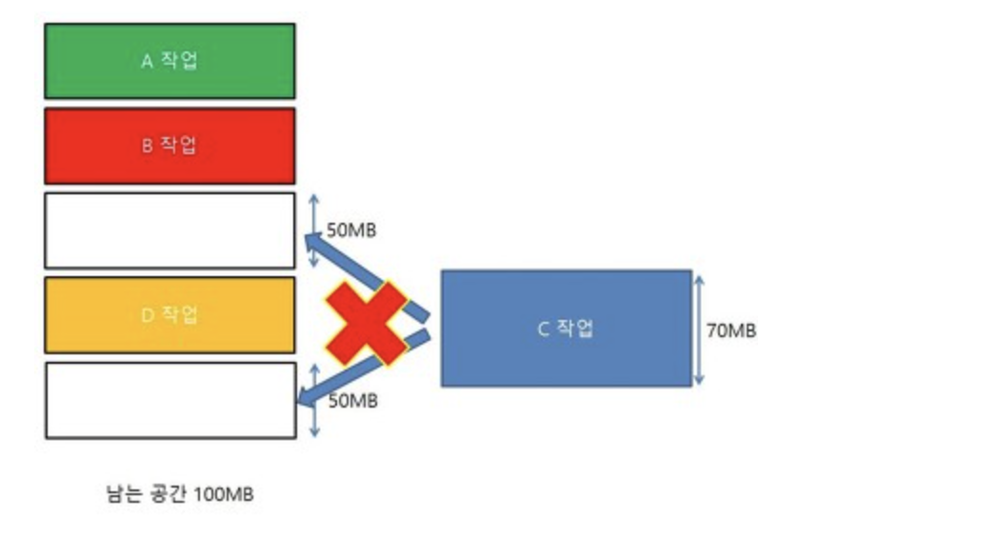

# 메모리 관리 기법

RAM에서 메모리의 공간이 작은 조각으로 나뉘어져 사용 가능한 메모리가 충분히 존재하지만 할당이 불가능한 상태

## 내부 단편화 (Internal Fragmentation)
-> Segmentation (Variable size)
 

메모리를 할당할 때 Process가 필요한 양보다 더 큰 메모리가 할당되어서 메모리 공간이 낭비되는 상황

(어떤 프로그램을 OS가 4kb를 할당해주었는데, 사실상 1kb만 사용하고 있을때 3kb만큼 내부단편화 발생)

## 외부 단편화 (External Fragmentation)
-> Paging (Fixed size)
 

메모리가 할당되고 해제되는 작업이 반복될 때 작은 메모리 중간중간에 사용하지 않는 메모리가 많이 존재해서 총 메모리 공간은 충분하지만 실제로 할당할 수 없을때

## 메모리 파편화 해결 방법
 
1. 페이징 기법 - 가상 메모리 사용, 외부 단편화 해결

보조기억장치, 가상메모리를 같은 크기의 블록으로 나눈 것을 페이지라고 하고 RAM을 페이지와 같은 크기로 나눈 것을 프레임이라고 한다.

페이징 기법이란? 

사용하지 않는 프레임을 페이지 (가상 메모리)에 옮기고, 필요한 메모리를 페이지 단위로 프레임에 옮기는 기법

페이지와 프레임을 대응시키기 위해 Page Mapping 과정이 필요해서 Paging table을 만든다.

2. 세그먼테이션 기법 - 가상 메모리 사용, 내부 단편화 해결

세그먼테이션 기법은 가상메모리를 서로 크기가 다른 논리적 단위인 세그먼트로 분할해서 메모리에 할당을 하여 실제 메모리 주소로 변환을 한다.

각 세그먼트는 연속적인 공간에 저장되어 있다.

mapping을 위해서 마찬가지로 Segment Table이 필요하다.

but, 프로세스가 필요한 메모리공간 만큼 할당해주기 때문에 내부단편화 문제는 일어나지 않지만, 중간에 메모리를 해제하면 생기는 외부단편화 문제가 발생한다.

- 출처 : https://developer-mac.tistory.com/21

