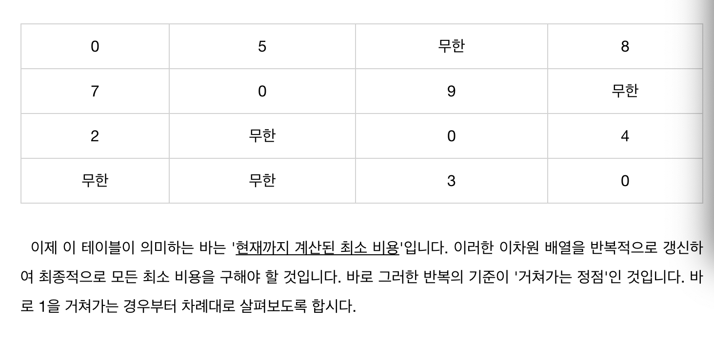

# 플로이드 와샬

애초에 거쳐가는 정점을 하나씩 설정해서 확인하는 방법이다.

각각의 정점을 가는 바용을 이차원 배열의 형태로 출력하면 다음과 같습니다.

2차원 배열을 사용해서 모든 정점에서 모든 정점으로 가는 경우의 최단 경로를 구합니다.

반복의 기준이 거처가는 정점이다.

# 다익스트라
  
가장 적은 비용을 가지는 노드를 하나씩 꺼내서 그 노드에 대해서 그노드를 거쳐가는 비용을 확인

  
