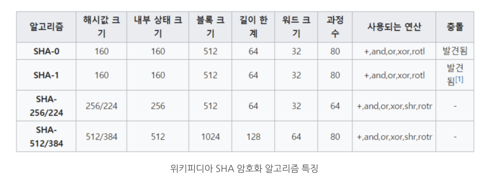
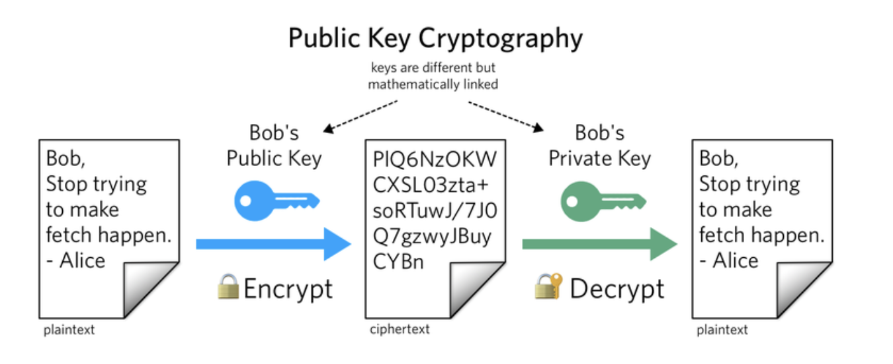
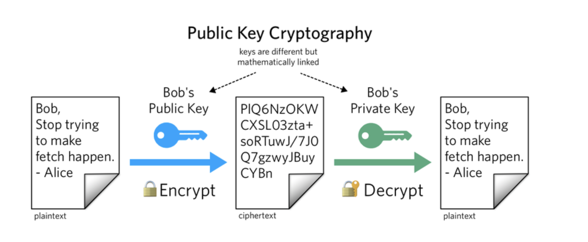

# 암호 알고리즘

암호에서 주로 쓰는 표현

평문 (Plaintext) : 암호화가 적용되지 않은 메세지

암호문(Ciphertext) : 암호화된 메세지 

암호화/복호화(Encryption/Decryption) : 암호문을 평문으로 변환하는 과정과 그 역의 과정

​

## 암호화 알고리즘의 구분

​

## 1. 단방향 암호 (One-way cryptography)
 

단방향암호는 흔히 Hash를 이용해 암호화를 하는것으로, 임의의 평문을 hash처리하였을때 그 복호화가 불가능한 암호화를 말한다. hash처리된 암호문을 평문으로 복호화가 불가능하므로, 단방향 암호라고 부르며 패스워드등에 사용된다.

EX) 웹사이트에 비밀번호를 입력하면, 해당 비밀번호의 hash값만 서버에서 저장해서 서로 비조대교 후 사용자 access 권한을 부여한다. 즉 데이터의 진위여부는 확인하고싶으나, 본 데이터의 privacy를 지키고 싶은 경우에 사용한다.

-hash값은 input의 아주 일부분만 바뀌어도 output 결과가 완전 상이하게 나타나는 눈사태효과의 특징을 갖는다.

## 2. 대칭키 암호화 알고리즘​
 

대칭키 암호화는 평문을 특정 대칭키로 암호화하고, 결과로 나온 암호문도 대칭키로 복호화 할 수 있는 방식을 의미한다. 

즉,  평문 -> 대칭키 -> 암호문 -> 대칭키 -> 평문 , 이런식으로 독해가 가능하다. 암호화/복호화에 필요한 키가 같다.

가장 보편적으로 사용되는 대칭키 알고리즘은 AES이다. 대칭키 암호는 암호처리에걸리는 시간이 빠르다는 장점이 있다. 그러나 대칭키의 경우, 수신자도 대칭키를 알아야하므로 이 대칭키를 어떻게 수신자에게 미리 안전하게 전달하느냐가 딜레마이다.

대칭키 암호는 암호화하는 단위에 따라 스트림암호와 블록암호로 나뉜다.

스트림암호는 연속적인 비트/바이트를 계속해서 입력받아, 그에 대응하는 암호화 비트/바이트를 생성하는 방식

블록암호는 정해진 한 단위(블록)을 입력받아 그에 대응하는 암호화블록을 생성하는 방식이다.

​

## 3. 비대칭키 암호 알고리즘
 

비대칭키 암호는 공개키암호라고도 불리며, 보통 개인키/공개키의 쌍으로 동작한다.개인키(Private key)는 꼭 숨겨서 보관해야할 키이고, 공개키(Public Key)는 상대방한테 공개해도 문제가 없다.

 동작을 쉽게 요약하자면

​

1. 평문 -> 공개키로 암호화 -> 암호문 -> 개인키로 복호화 ->  평문

2. 평문 -> 개인키로 암호화 -> 암호문 -> 공개키로 복호화 -> 평문

의 특징을갖는다.

1을 보면, 공개키로 암호화된 암호문은 개인키로만 복호화가 가능하므로, 내가 원하는 수신인을 특정하여 보내려고할때 그 수신인의 공개키로 암호화를 해서 보내면 된다. 해당 메세지는 그 수신인의 개인키로만 복호화가 가능하기 때문이다.

2의 경우, 내가 어떤 메세지를 나의 개인키로 암호화해서 다른이에게 보낸다고 가정하자. 다른사람은 나의 공개키를 알것이므로, 만약 해당 메세지가 내 공개키로 복호화가 된다면, 해당 메세지의 발신인이 '나'임이 증명되는 것이다.  

따라서, 2의 경우 (개인키 서명) 해당 메세지의 발신임임을 증명하기 위한 암호화로 쓰이며, 1의 경우 수신인 보증을 위한 암호화라고 볼 수 있다.

하지만 이러한 비대칭형 암호는 느리다는 단점이 있다. 따라서 인터넷 http 등 주기적으로 서버와 인터넷 통신을하는 client는, 보통 처음에만 비대칭형 암호로 신원을 확인하고, 그 후 세션키를 통한 대칭키 통신을 사용하여 빠른 인증을 한다.

또, 발신인이 공개키를 배포할 때 공격자가 발신인의 공개키를 자신의 키로 바꾸어 중간에서 정보를 해킹하는 Man-In-The-Middle Attack이 가능하기 때문에 공개키와 소유자(발신인)를 안전하게 바인딩하는 Public-key Infrastructure (PKI)도 추가적으로 필요하다.

비대칭형 암호는 Public key와 Private Key가 쌍으로 이루어져있는데, 먼저 개인키가 생성되고 이에 대응하는 public key가 만들어진다.

​

현재 공인인증서 HTTP, SSL, 블록체인 등 다양한 서비스들이 위 3가지 방식이 조합되는 방식으로 보안을 유지하고있다. 

### 용도별 암호알고리즘의 사용을 정리하자면 다음과 같다.

전자 서명, 전송 부인 방지 : 비대칭 키 암호화

파일 자체 암호화, privacy 유지 : 대칭 키 암호화

데이터 원본 확인 : hash

​

그러나 이러한 암호방식도 결국 key (대칭키, 비밀키) 를 도난당하면 말짱 도루묵이라는 단점이 있다. 이러한 단점을 해결하기위해 최근에는 토큰 기반 key와 2중, 3중 인증 (OTP, FIDO) 등을 곁들여서 보안을 강화하고있는 추세이다.

​

- 출처 : https://m.blog.naver.com/awp2122/221756639476

