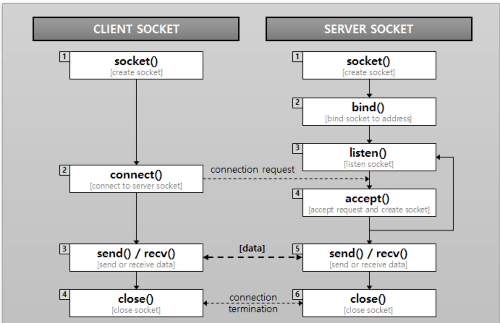

# 웹 통신 흐름
  

  
우리가 Chrome 을 실행시켜 주소창에 특정 URL 값을 입력시키면 어떤 일이 일어나는가?

### in 브라우저
   1. url 에 입력된 값을 브라우저 내부에서 결정된 규칙에 따라 그 의미를 조사한다.
   2. 조사된 의미에 따라 HTTP Request 메시지를 만든다.
   3. 만들어진 메시지를 웹 서버로 전송한다.  
이 때 만들어진 메시지 전송은 브라우저가 직접하는 것이 아니다. 브라우저는 메시지를 네트워크에 송출하는 기능이 없으므로 OS에 의뢰하여 메시지를 전달한다. 우리가 택배를 보낼 때 직접 보내는게 아니라, 이미 서비스가 이루어지고 있는 택배 시스템(택배 회사)을 이용하여 보내는 것과 같은 이치이다. 단, OS에 송신을 의뢰할 때는 도메인명이 아니라 ip주소로 메시지를 받을 상대를 지정해야 하는데, 이 과정에서 DNS서버를 조회해야 한다.

### in 프로토콜 스택, LAN 어댑터

   1. 프로토콜 스택(운영체제에 내장된 네트워크 제어용 소프트웨어)이 브라우저로부터 메시지를 받는다.
   2. 브라우저로부터 받은 메시지를 패킷 속에 저장한다.
   3. 그리고 수신처 주소 등의 제어정보를 덧붙인다.
   4. 그런 다음, 패킷을 LAN 어댑터에 넘긴다.
   5. LAN 어댑터는 패킷을(?) 전기신호로 변환시킨다.
   6. 신호를 LAN 케이블에 송출시킨다.
프로토콜 스택은 통신 중 오류가 발생했을 때, 이 제어 정보를 사용하여 고쳐 보내거나, 각종 상황을 조절하는 등 다양한 역할을 하게 된다. 네트워크 세계에서는 비서가 있어서 우리가 비서에게 물건만 건네주면, 받는 사람의 주소와 각종 유의사항을 써준다! 여기서는 프로토콜 스택이 비서의 역할을 한다고 볼 수 있다.

### in 허브, 스위치, 라우터
   1. LAN 어댑터가 송신한 패킷은 스위칭 허브를 경우하여 인터넷 접속용 라우터에 도착한다.
   2. 라우터는 패킷을 프로바이더(통신사)에게 전달한다.
   3. 인터넷으로 들어가게 된다.

### in 액세스 회선, 프로바이더
   1. 패킷은 인터넷의 입구에 있는 액세스 회선(통신 회선)에 의해 POP(Point Of Presence, 통 신사용 라우터)까지 운반된다.
   2. POP 를 거쳐 인터넷의 핵심부로 들어가게 된다.
   3. 수 많은 고속 라우터들 사이로 패킷이 목적지를 향해 흘러가게 된다.

### in 방화벽, 캐시서버
   1. 패킷은 인터넷 핵심부를 통과하여 웹 서버측의 LAN 에 도착한다.
   2. 기다리고 있던 방화벽이 도착한 패킷을 검사한다.
   3. 패킷이 웹 서버까지 가야하는지 가지 않아도 되는지를 판단하는 캐시서버가 존재한다.  
굳이 서버까지 가지 않아도 되는 경우를 골라낸다. 액세스한 페이지의 데이터가 캐시서버에 있으면 웹 서버에 의뢰하지 않고 바로 그 값을 읽을 수 있다. 페이지의 데이터 중에 다시 이용할 수 있는 것이 있으면 캐시 서버에 저장된다.

### in 웹 서버
   1. 패킷이 물리적인 웹 서버에 도착하면 웹 서버의 프로토콜 스택은 패킷을 추출하여 메시지를 복원하고웹 서버 애플리케이션에 넘긴다.
   2. 메시지를 받은 웹 서버 애플리케이션은 요청 메시지에 따른 데이터를 응답 메시지에 넣어 클라이언트로 회송한다.
   3. 왔던 방식대로 응답 메시지가 클라이언트에게 전달된다.

알고싶었던 것

 소켓 : 소프트웨어로 작성된 통신 접속점, 응용프로그램은 소켓을 통하여 통신망으로 데이터를 송수신하게 된다.
   - TCP/IP를 이용하는 창구 역할
   - 두 프로그램이 네트워크를 통해 서로 통신을 수행할 수 있도록 양쪽에 생성되는 링크의 단자
   -  서로 다른 프로세스끼리 데이터 전달이 가능하다 !
udp
   - 클라이언트와 서버 모두 소켓을 열어주고, 클라이언트에서 서버 호스트와 포트로 데이터그램을 생성합니다.
   - 서버에서는 생성된 데이터 그램을 읽어들여서 소켓을 이용하여 서버 호스트와 포트로 반환합니다.
   - 다시 클라이언트에서는 소켓으로 받은 데이터 그램을 읽어 값을 얻게 됩니다

tcp
   - 서버에서 소켓을 열고, 연결 요청을 기다립니다.
   - 이 때에 클라이언트에서 소켓을 열고 호스트와 포트로 서버에 연결을 요청합니다.
   - 서버에서 소켓을 통해 요청을 수락하면 새로운 소켓이 생성되고, 해당 소켓으로 통신하게 됩니다.

   - 출처 : https://github.com/JaeYeopHan/Interview_Question_for_Beginner/blob/master/Network/README.md#%EC%9B%B9-%ED%86%B5%EC%8B%A0%EC%9D%98-%ED%81%B0-%ED%9D%90%EB%A6%84